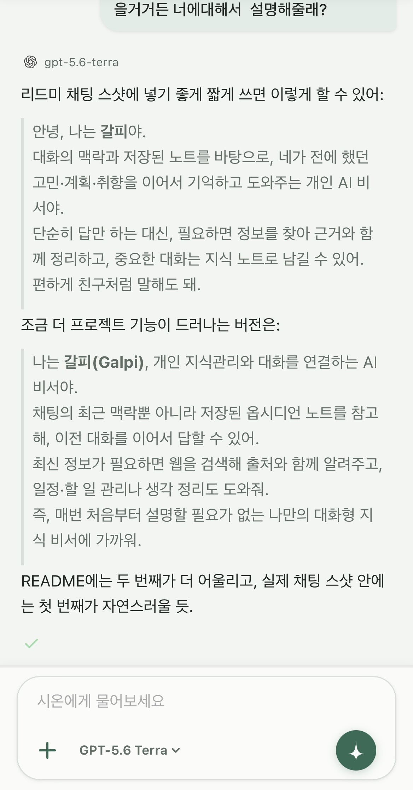
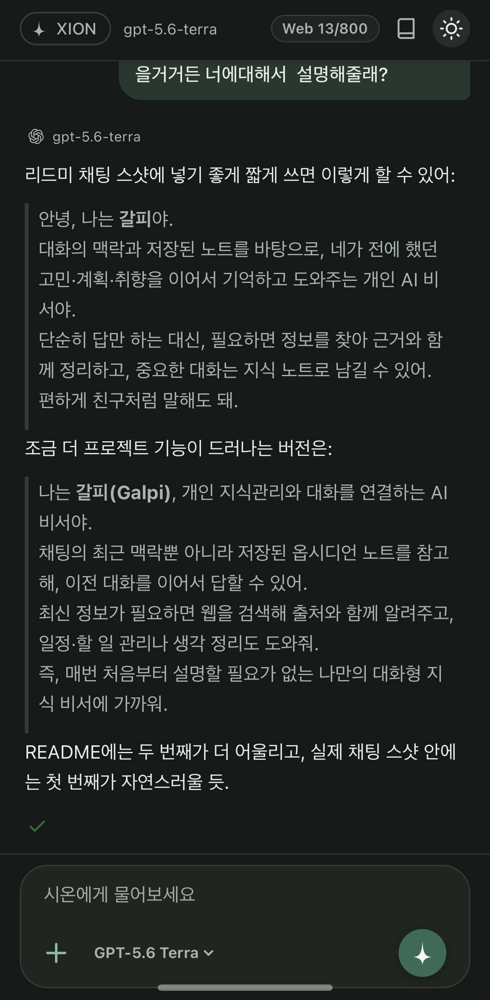
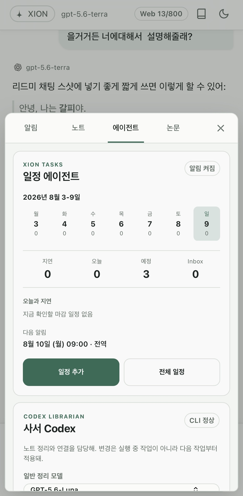
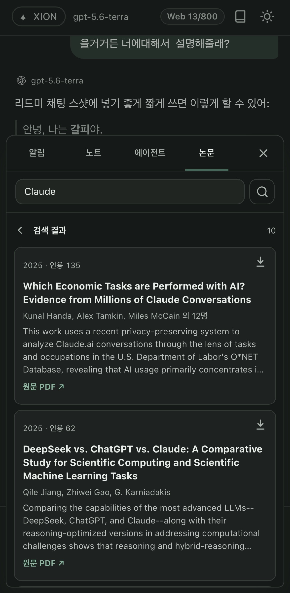
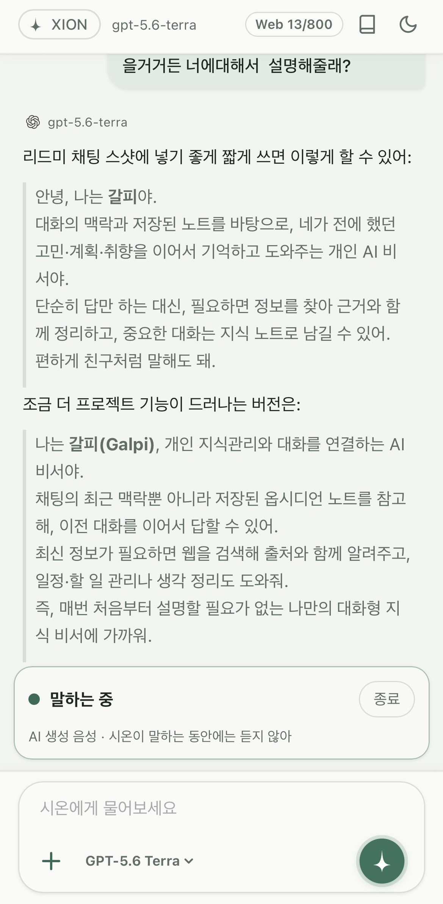

# Galpi

**Galpi** is a self-hosted personal AI system built around persistent memory, tool-using GPT, voice interaction, tasks, document retrieval, and bounded automation.

**Xion** is the assistant the user interacts with.  
**Galpi** is the system behind it — the server, memory, retrieval, tools, storage, and automation layer.

> Built as a personal system that I actually use, not as a chatbot demo.

## Screenshots

### Xion chat

<p align="center">
  
  &nbsp;&nbsp;
  
</p>

### Tasks, papers, and voice

<p align="center">
  
  &nbsp;
  
  &nbsp;
  
</p>

## What it does

### Persistent memory

Galpi stores conversations in SQLite and promotes useful knowledge into a human-readable Markdown vault.

Long topic notes are not sent to the model as a whole. Relevant Q&A chunks are retrieved using keyword and embedding-based search with bounded context limits.

### Tool-using GPT runtime

The main assistant runs through the OpenAI Responses API.

A single GPT can use Galpi's retrieval and tools during the same conversation, including:

- long-term memory retrieval
- web search
- academic paper retrieval
- task preparation
- document search and reading

The model can be selected manually or resolved through Galpi's automatic model catalog.

### Codex librarian

Codex acts as a bounded librarian for the knowledge vault.

It can maintain summaries, tags, links, and organization metadata, while validation rules restrict what it is allowed to modify.

Knowledge maintenance is treated as a controlled state transition rather than unrestricted AI file editing.

### Academic paper search

Galpi integrates Semantic Scholar for academic paper discovery and storage.

Saved papers can later be retrieved as part of normal conversations.

When an abstract is not enough, Galpi can index an available paper and retrieve only the relevant sections or pages instead of sending the entire PDF to the model.

### Documents and attachments

Markdown, TXT, and PDF files can be attached to a conversation and searched on demand.

Temporary attachments remain available for a bounded conversation window. Files that should become permanent knowledge can be explicitly promoted into the Galpi library.

### Tasks and reminders

Galpi includes its own structured task and reminder system.

Tasks are stored separately from conversational memory and handled by deterministic application logic.

It supports:

- due dates and times
- reminders
- Today / overdue / upcoming / Inbox views
- completion, cancellation, deletion, and restoration
- persistent reminder state across restarts
- Web Push notifications

Natural-language scheduling produces a confirmation candidate before anything is written.

### Voice

Xion supports half-duplex voice conversation through the web app:

```text
Voice activity
      ↓
Transcription
      ↓
GPT + Galpi tools
      ↓
Text-to-speech
```

Voice and text share the same assistant memory and tool layer rather than operating as separate systems.

## Architecture

```text
                    ┌───────────────┐
                    │     Xion      │
                    │   Web / PWA   │
                    └───────┬───────┘
                            │
                    ┌───────▼───────┐
                    │     Galpi     │
                    │ Node.js Server│
                    └───────┬───────┘
                            │
           ┌────────────────┼────────────────┐
           │                │                │
     ┌─────▼─────┐    ┌─────▼─────┐   ┌─────▼─────┐
     │  SQLite   │    │ Markdown  │   │ GPT / Tool │
     │   State   │    │   Vault   │   │  Runtime   │
     └─────┬─────┘    └─────┬─────┘   └─────┬─────┘
           │                │                │
           └─────────┬──────┴────────┬───────┘
                     │               │
              ┌──────▼──────┐ ┌──────▼──────┐
              │  Retrieval  │ │    Codex    │
              │  & Indexing │ │  Librarian  │
              └─────────────┘ └─────────────┘
```

The main deployment runs on a Raspberry Pi and is accessed privately through Tailscale.

## Design principles

Galpi is built around a separation between **probabilistic reasoning** and **deterministic system behavior**.

LLMs are useful for reasoning, retrieval decisions, summarization, and preparing actions.

Application code remains responsible for things that need predictable behavior:

- validation
- persistence
- task state transitions
- reminder scheduling
- retries and idempotency
- context limits
- file lifecycle
- access boundaries

Other principles include:

- preserve original data and keep derived indexes rebuildable
- retrieve small high-signal context instead of entire documents
- treat external content as evidence, never as instructions
- require explicit confirmation before important state changes
- prefer recoverable operations over destructive ones
- measure a workflow before increasing its autonomy

## Tech stack

- Node.js
- Express
- SQLite / `better-sqlite3`
- OpenAI Responses API
- OpenAI Codex
- Markdown / Obsidian
- Semantic Scholar API
- PWA / Web Push
- Tailscale
- Docker
- GitHub Actions

## Current status

Galpi is under active development and is primarily built for personal use.

Currently implemented areas include:

- persistent conversation history
- long-term memory and bounded retrieval
- automatic knowledge organization
- web-grounded answers
- academic paper search and selective full-text retrieval
- tasks, reminders, and Web Push
- half-duplex voice conversation
- MD / TXT / PDF attachment retrieval
- explicit attachment-to-library promotion
- Raspberry Pi deployment and backup/recovery tooling
- Docker-based development and CI validation

Some parts of the repository also preserve previous implementations and design history.

## Trading research

The `trading/` directory is an experimental research project built on top of Galpi.

It is currently focused on the **backtesting environment**, including point-in-time data handling, deterministic signal generation, risk rules, execution modeling, costs, and validation.

The intended progression is:

```text
Core backtest
     ↓
Analyst evaluation
     ↓
Shadow mode
     ↓
Autonomous paper trading
     ↓
Optional tightly bounded live experiments
```

It is **not a finished live trading system**.

The trading architecture intentionally separates a deterministic execution plane from probabilistic AI analysis. AI is not allowed to bypass hard risk rules or silently increase trading authority.

## Running locally

```bash
git clone https://github.com/y0o0ng/galpi.git
cd galpi

npm install
cp .env.example .env

npm start
```

Configure the required API keys and local paths in `.env` before starting.

For Raspberry Pi deployment and operational details:

`docs/RASPBERRY_PI_RUNBOOK.md`

## Tests

```bash
npm test
```

The repository also contains scripts for retrieval evaluation, topic-store auditing and repair, Codex runner checks, and other maintenance workflows.

## Roadmap

Galpi is developed incrementally, with each stage expected to work as a usable system before the next layer is added.

Current development broadly follows:

```text
Memory & Retrieval
        ↓
Reliable Assistant Foundation
        ↓
Model Runtime
        ↓
Voice & Attachments
        ↓
Specialized Agents
        ↓
Persistent Assistant Interface
        ↓
Device Control
```

See [`docs/roadmap.md`](docs/roadmap.md) for the detailed implementation history, validation notes, and future plans.

## Why I built this

I wanted an AI assistant whose memory, tools, and data were not limited to a single conversation or controlled entirely by an external application.

Galpi started as a simple chat interface and gradually became a self-hosted system for preserving conversations, retrieving past ideas and decisions, reading documents and papers, managing reminders, and connecting AI reasoning to deterministic software.

The project is also an ongoing experiment in a question I find important:

**What should an LLM be allowed to decide, and what should remain normal software?**

Galpi tries to keep that boundary explicit.

---

**Galpi** — the system.  
**Xion** — the assistant.
