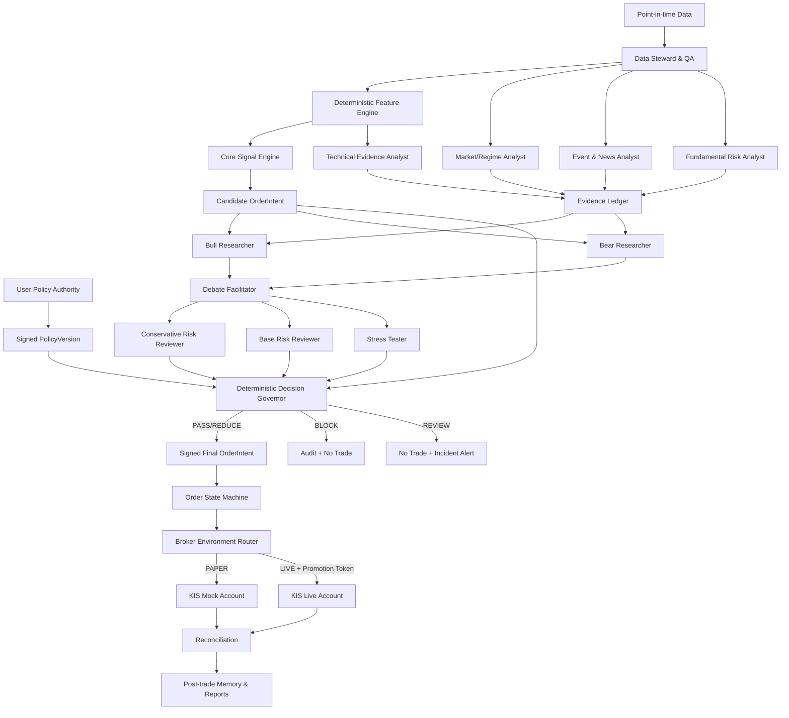
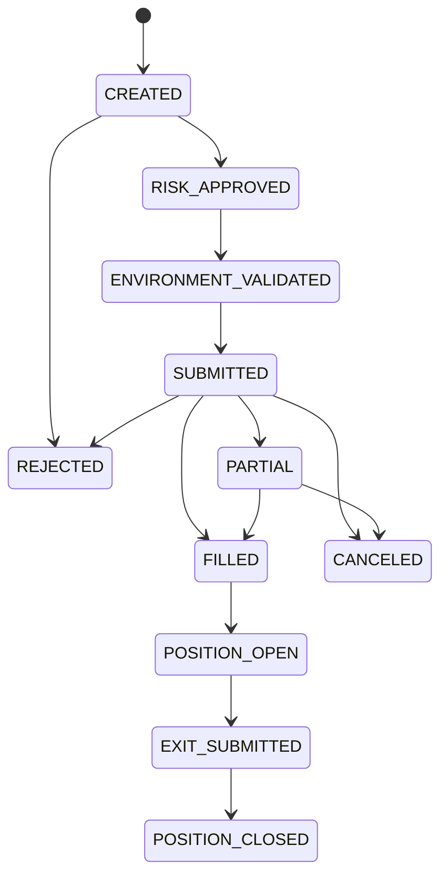
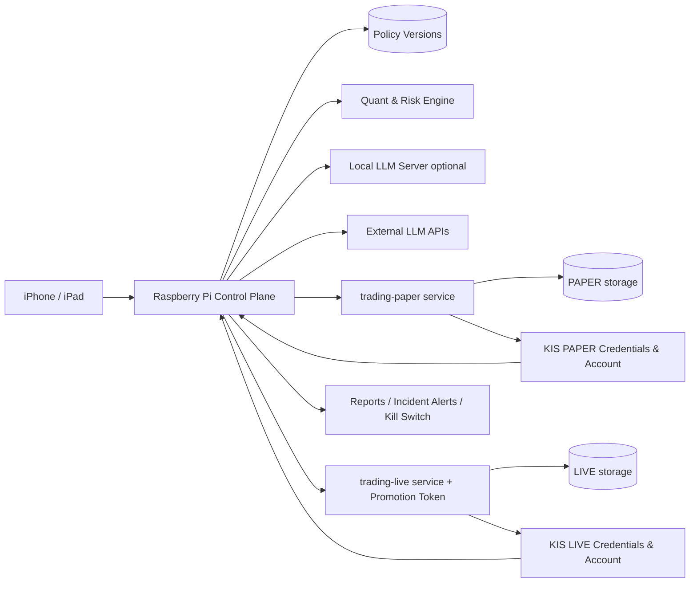

# 갈피 스윙 트레이딩 에이전트 설계 문서 v2.3

> **이름 경계**  
> 시스템·서비스·저장소·정책의 주체는 갈피(`galpi`)다. 시온(`XION`)은 사용자에게 분석·체결·위험·장애를 보고하고 승인 화면을 여는 비서 인터페이스다. 기존 본문의 “Xion이 운용한다”는 표현은 사용자 관점의 축약이며, 실제 주문 권한은 갈피의 결정론적 Governor와 격리된 broker service에만 있다.

> **핵심 원칙**  
> 갈피는 LLM이 감으로 종목을 맞혀 주문하는 봇이 아니다. **결정론적 퀀트 엔진이 후보·수량·손절을 계산하고, 검증된 분석 에이전트는 근거를 조사하며 위험을 줄이거나 거래를 보류한다.** 사용자는 개별 주문이 아니라 거래 정책·위험 한도·운영 단계를 사전 승인한다. 승인된 정책 안에서는 PAPER를 자율 운용하고, 장기적으로 별도 정량 게이트를 통과한 LIVE도 정책 사전승인형으로 자율 운용한다.

> **주의**  
> 이 문서는 연구·개발용 시스템 설계안이다. 수익을 보장하지 않으며, 실제 주문 전 브로커 정책·세금·시장 규정·데이터 라이선스를 다시 확인해야 한다.

> **v2.1 변경 요약**  
> 기본 운영 모드를 “사용자 주문 승인 대기”에서 **한투 모의계좌 완전 자율 운용**으로 전환했다. 개별 주문 대신 정책을 사전 승인하고, PAPER/LIVE 환경 격리·Promotion Token·모의환경 한계·무인 운영 SLO를 추가했다.

> **v2.2 변경 요약**  
> 소액 계좌 × 정수 주식 제약에서 계산 수량이 1주 미만이 되어 고가 종목이 유니버스에서 암묵적으로 배제되는 문제를 해결했다. **최소수량 예외 규칙**(9.1.1)을 추가하고, 소수점(단주 미만) 주문은 일괄체결 방식이 손절·갭 취소 실행과 불일치하므로 사용을 금지했다. **고정비 예산과 손익분기 게이트**(12.4)를 추가해 데이터·LLM 비용이 기대수익을 초과하는 상태로 LIVE에 진입하지 못하게 했다. **검정력과 표본 설계**(14.9)를 추가해 LLM 증분 효과의 1차 판정을 장기 백테스트의 짝지은(counterfactual) 비교로 옮기고, 소표본 실운용에서의 성과 판정을 명시적으로 유보했다.

> **v2.3 변경 요약**  
> 장기 목표를 정책 사전승인형 자율 LIVE로 확정하되 단계 간 자동 승격은 계속 금지했다. 선택적 `LIVE_PROPOSAL_ONLY`와 `LIVE_MICRO_POLICY_AUTONOMOUS`를 분리하고 정량 승격 게이트를 명시했다. 거래 Champion 모델은 exact snapshot·prompt·tool schema와 함께 PolicyVersion에 고정하고 채팅·Codex의 자동 최신을 상속하지 않는다. 사용자용 의회 퇴역과 trading 내부 Bull/Bear 실험을 분리했으며, PAPER/LIVE는 같은 DB 안의 schema가 아니라 별도 service·storage·secret·queue로 격리한다. 강의 노트는 V5-B 전 또는 PAPER 장기 관찰 중 독립 자원으로 병행할 수 있다.

-----

## 0. Executive Summary

### 0.1 최종 권고안

갈피 v2.3의 첫 운영 전략은 다음과 같이 설계한다.

|항목       |결정                                                                                       |
|---------|-----------------------------------------------------------------------------------------|
|시장       |미국 상장 대형·고유동성 보통주                                                                        |
|방향       |롱온리, 무레버리지                                                                               |
|시간축      |일봉, 평균 5~30거래일 보유                                                                        |
|기본 알파    |63일 상대모멘텀 + 60일 추세 품질 + 20일 신고가 돌파                                                       |
|시장 상태    |SPY 장기 추세 + 실현변동성 + 계좌 낙폭                                                                |
|초기 위험 프로필|거래당 계획 위험 0.25%, 총 익스포저 60%, 동시 5종목. 계산 수량 1주 미만 시 최소수량 예외(실효 위험 ≤ 0.5%일 때만 1주 진입, 9.1.1)|
|성숙 위험 프로필|별도 승격 후 거래당 0.5%, 총 익스포저 최대 100%                                                         |
|LLM 역할   |뉴스·공시·펀더멘털 요약, Bull/Bear 반론, 위험 검토, 설명·감사                                                |
|LLM 권한   |**신규 거래 생성 불가, 수량 확대 불가, 손절 완화 불가**                                                      |
|기본 운영 모드 |**한국투자증권 모의투자 계좌 완전 자율 운용**                                                              |
|사용자 역할   |정책 변경, 위험 한도 상향, 실전 단계 승격, HALT 복구 승인                                                    |
|정상 알림    |주문 승인 요청이 아니라 체결·손익·위험·장애 보고                                                             |
|기대 목표    |성숙 프로필 기준 비용 후 연 8~15%, 목표 MDD 8~15%                                                     |
|실전 전환    |장기 백테스트 → Shadow → 자율 모의투자 → 마이크로 실전                                                     |

**핵심 운영 원칙은 “거래 사전승인”이 아니라 “정책 사전승인”이다.** 정상적인 주문은 사용자의 응답을 기다리지 않는다. 정책 밖의 행동, 실전 전환, 위험 한도 상향, HALT 복구만 사람이 승인한다.

### 0.2 TradingAgents 논문에서 가져온 것과 버린 것

TradingAgents는 펀더멘털·감성·뉴스·기술 분석가, Bull/Bear 연구자, 위험 성향별 검토자, 트레이더와 펀드매니저를 역할별로 분리하고, 자연어 대화 대신 구조화된 보고서를 중심으로 상태를 전달한다.[^TA] 이 조직 구조와 통신 방식은 갈피의 실험 설계에 유용하다.

하지만 논문의 실험은 2024년 1월~3월의 짧은 기간에 집중되어 있고, 표에 제시된 결과도 AAPL·GOOGL·AMZN의 소수 종목이다. 저자 역시 예측 1회당 11회의 LLM 호출과 20회 이상의 도구 호출이 들어갔으며, 매우 높은 Sharpe가 짧은 기간의 적은 조정에서 비롯되었을 가능성을 명시했다.[^TA] 따라서 논문의 20%대 수익률을 갈피의 기대수익으로 사용하지 않는다.

|TradingAgents 요소     |갈피 v2.3 반영      |수정 이유                                             |
|---------------------|------------------|--------------------------------------------------|
|전문화된 분석가             |채택                |역할별 도구·책임·출력을 분리하면 오류 추적이 쉬움                      |
|Bull/Bear 토론         |조건부 실험            |Single Analyst보다 표본 밖 증분 효과가 확인될 때만 활성화                |
|Risky/Neutral/Safe 토론|후속 실험             |Risky는 수량 확대자가 아니라 **스트레스 테스터**로 제한               |
|구조화된 보고서             |강하게 채택            |긴 대화의 정보 손실과 “전화게임” 방지                            |
|LLM 트레이더가 매수·매도 결정   |거부                |재현성·보안·손실 통제가 약함                                  |
|LLM 펀드매니저가 최종 승인     |구조만 채택            |최종 승인은 결정론적 Governor가 담당하며, 정상 주문마다 사람 승인을 요구하지 않음|
|60개 기술지표를 LLM이 종합    |거부                |중복 정보와 과적합 위험. 핵심 신호는 소수로 고정                      |
|뉴스·감성·펀더멘털을 직접 알파로 사용|v1.5 이후 Challenger|시간 정렬·데이터 비용·재현성을 먼저 검증해야 함                       |
|자연어 설명 가능성           |채택                |주문의 근거와 오류 원인을 사람이 검토 가능                          |

### 0.3 v1 대비 가장 큰 변화

1. **퀀트 실행면과 LLM 지능면을 분리**한다.
1. 단일 Analyst가 아니라 **전문화된 에이전트 위원회**를 둔다.
1. 자연어 결론을 주문으로 연결하지 않고 **Evidence Ledger와 JSON Schema**로 전달한다.
1. LLM은 기본 수량을 늘리지 못하며 **PASS / REDUCE / BLOCK / REVIEW**만 반환한다.
1. 모든 뉴스·공시 주장은 출처와 `published_at`, `available_at`, `ingested_at`을 가져야 한다.
1. LLM의 효과를 “전략 전체 수익”이 아니라 **Core 대비 증분 성과**로 A/B 검증한다.
1. 같은 입력을 반복 실행하여 **결정 일치율과 모델 버전 민감도**를 검증한다.
1. 기본 운영 모드를 **한투 모의계좌 완전 자율 운용**으로 변경한다.
1. PAPER와 LIVE는 동일 전략·리스크·주문 코드를 사용하되 자격증명·계좌·DB·실행 권한을 물리적으로 분리한다.
1. 사람은 개별 주문이 아니라 `PolicyVersion`과 단계 승격을 승인한다. 모의에서 실전으로의 자동 승격은 금지한다.
1. `REVIEW`는 승인 대기 주문이 아니라 **기본적으로 미실행 + 경보**다. 사람이 자리에 없어도 위험이 확대되지 않는다.
1. 한투 모의 환경은 주문 수명주기와 복구 검증에 사용하고, 실제 슬리피지·유동성의 완전한 대리물로 간주하지 않는다.

-----

# 1. 투자 명령서

## 1.1 목표

갈피 trading system의 목표는 매일 시장을 예언하는 것이 아니라 다음을 반복하는 것이다.

1. 통계적으로 검증된 조건에서만 위험을 감수한다.
1. 한 번의 실수나 장애가 계좌를 훼손하지 못하게 한다.
1. 판단·데이터·주문·체결을 나중에 완전히 재현할 수 있게 기록한다.
1. LLM이 추가하는 복잡성이 실제 성과와 안전성을 개선하는지 별도로 증명한다.
1. 사용자가 잠들거나 휴대폰을 보지 못해도 승인된 정책 안의 진입·청산·복구가 자동으로 완료되게 한다.

## 1.2 성공 우선순위

1. 파산과 대형 손실 방지
1. 중복 주문·잔고 불일치·데이터 오염 방지
1. 백테스트와 실전 실행의 일치
1. 최대낙폭 통제
1. 비용 후 양의 기대값
1. SPY 대비 위험조정 초과성과
1. 그다음에 절대수익 확대

## 1.3 절대 금지사항

- 옵션, 신용, 공매도, 레버리지·인버스 ETF 사용 금지
- 소수점(단주 미만) 주문 사용 금지 - 주문 취합 후 일괄체결 방식은 손절·갭 취소·시장성 지정가 실행과 불일치
- 손실 종목 물타기 금지
- 진입 후 초기 손절을 아래로 넓히는 행위 금지
- LLM 자연어를 주문 API에 직접 전달 금지
- LLM이 수량·손절·최대 익스포저를 상향하는 행위 금지
- 출처 없는 뉴스·소셜미디어 주장 사용 금지
- 데이터 품질 검사가 실패한 상태에서 신규 주문 금지
- 모델·프롬프트·파라미터를 실전 손실 직후 즉흥적으로 변경 금지
- PAPER에서 LIVE로 자동 승격하는 기능 금지
- PAPER와 LIVE의 API 키·계좌·DB 저장소·서비스·주문 큐 공유 금지
- `REVIEW` 상태를 시간 경과만으로 자동 승인하는 행위 금지
- 사용자가 오프라인이라는 이유로 위험 한도를 임시 상향하는 행위 금지

## 1.4 사전승인된 정책 안의 자율성

갈피의 자율성은 무제한 재량이 아니라 **버전이 고정된 정책 안에서의 자동 실행 권한**이다.

사용자가 사전에 승인하는 항목은 다음과 같다.

- 거래 가능 시장·종목군·시간축
- 전략 버전과 지표 파라미터
- 거래당 위험, 총 익스포저, 종목·섹터 한도
- 진입·청산·손절·갭 취소 규칙
- LLM Gate의 허용 행동
- PAPER 또는 LIVE 운영 단계
- HALT 조건과 복구 절차

정책 버전이 활성화된 동안 정상 주문은 사용자 응답을 기다리지 않는다. 다음 행동만 별도 승인이 필요하다.

- 위험 예산 또는 총 익스포저 상향
- 새 종목군·시장·전략·모델의 실전 활성화
- 옵션·레버리지·공매도 활성화
- PAPER에서 LIVE로의 단계 전환
- 자동 HALT 이후 재가동
- 브로커 계좌·API 키·자금 이동 변경

```text
사람: 헌법과 예산을 승인
갈피: 헌법 안에서 24시간 운용
Governor: 모든 주문이 헌법 안인지 기계적으로 검증
```

-----

# 2. 시장 선택: 미국 주식 우선

## 2.1 선택

v2.3은 **미국 대형·고유동성 주식**으로 시작한다.

|평가축     |미국 시장                    |한국 시장                |v2 판정   |
|--------|-------------------------|---------------------|--------|
|종목 폭·유동성|대형주와 섹터별 선택 폭이 큼         |충분하지만 시장 집중도가 상대적으로 큼|미국 우선   |
|데이터·연구  |장기 가격·기업행동·펀더멘털·뉴스 생태계 풍부|공급자와 포맷 의존도가 큼       |미국 우선   |
|자동매매 API|해외주식 주문·시세 API 후보 존재     |국내 API도 가능           |미국 구현 가능|
|세금      |국외주식 과세·환율 원장 필요         |일반 소액주주 상장주식은 구조가 다름 |한국 유리   |
|환율      |USD/KRW 변동이 원화 성과에 추가    |원화 자산                |한국 유리   |
|전략 검증   |모멘텀·추세 연구 축적이 큼          |별도 포팅 검증 필요          |미국 우선   |

한국투자증권 KIS Developers는 국내·해외주식 시세·주문 관련 API 문서를 제공한다. 미국 증권 결제는 2024년 5월 T+1로 전환되었고, Nasdaq 정규 시장 시간은 09:30~16:00 ET다.[^KIS][^SEC][^NASDAQ]

## 2.2 왜 세금 때문에 국장부터 시작하지 않는가

초기 자금 500만 원과 연 8~15% 목표를 가정하면 연간 목표 손익은 약 40만~75만 원이다. 현재 국외주식은 연간 기본공제와 확정신고 체계가 존재하므로 세금 원장은 필요하지만, 초기 검증 단계의 핵심 병목은 세금보다 **전략의 유효성·데이터·체결·운영 안정성**이다.[^NTS]

세법은 바뀔 수 있으므로 갈피는 세율을 코드에 하드코딩하지 않고 `tax_rule_version`으로 관리한다.

## 2.3 국장 포팅 조건

다음 조건을 모두 충족한 뒤 KOSPI 200 point-in-time 유니버스로 포팅한다.

- 미국 전략의 실전·Shadow 데이터 12개월 이상
- 중대 주문 장애 0건
- 비용 후 기대값 양수
- 국장용 가격제한폭·VI·동시호가·정규장 체결 모델 구현
- 세후·비용 후 미국 버전보다 유의미한 개선

-----

# 3. 시스템 철학: 두 개의 평면

갈피는 **Execution Plane**과 **Intelligence Plane**을 분리한다.

## 3.1 Execution Plane - 결정론적·재현 가능

- point-in-time 데이터 수집과 품질 검사
- 지표 계산
- 후보 선정
- 포지션 크기와 손절 계산
- 포트폴리오 한도
- 주문 상태 머신
- 브로커 대조
- 감사 로그

동일한 데이터·전략 버전·계좌 상태를 넣으면 항상 같은 결과가 나와야 한다.

## 3.2 Intelligence Plane - 확률적·비신뢰

- 뉴스와 공시 요약
- 기업 이벤트 식별
- Bull/Bear 반론
- 과거 유사 사례 검색
- 위험 시나리오 생성
- 사용자용 설명

이 평면은 실행면의 거래 후보를 **추가 생성하거나 위험을 확대하지 못한다.** 오직 거래를 통과시키거나, 크기를 줄이거나, 막거나, 사용자 검토로 보낼 수 있다.



## 3.3 사용자용 의회와 trading 내부 실험의 분리

이 문서의 Bull/Bear·Risk Committee는 사용자용 의회 채팅 기능을 재사용하거나 부활시키지 않는다.

- 신규 council API·transcript·UI를 만들지 않는다.
- 모델끼리 자유 대화하는 구조가 아니라 고정 JSON Schema의 trading 내부 실험군이다.
- 첫 구현은 `Core + Single Event Analyst`다.
- Bull/Bear는 같은 입력의 counterfactual replay에서 Single Analyst보다 측정 가능한 증분 효과가 있을 때만 Challenger로 추가한다.
- Risk Committee도 hard veto를 대체하지 못하며 증분 효과가 없으면 제거한다.

위 diagram은 최대로 확장된 후보 구조다. 구현 순서를 뜻하지 않는다.

-----

# 4. 역할 설계

## 4.1 Data Steward - 비LLM

**목표:** 모든 에이전트가 동일하고 유효한 시점의 데이터를 보도록 보장한다.

**책임**

- 가격·거래량·기업행동·실적 일정·공시·뉴스 시점 정렬
- 분할·배당·티커 변경·상장폐지 처리
- 누락·중복·비정상 수익률 감지
- 데이터 스냅샷 불변 저장
- 데이터 출처·수집 시각·수정 버전 기록

**권한**

- 이상이 있으면 해당 종목 또는 전체 신규 진입을 차단
- 데이터를 임의로 보정하지 않고 `QUARANTINED` 상태로 격리

## 4.2 Quant Core Analyst - 비LLM

**목표:** 고정된 전략 명세로 후보를 생성한다.

**출력**

- 지표 값
- 진입 게이트 통과 여부
- 순위 점수
- 기준 진입가·손절가·수량
- 전략 버전과 feature hash

Quant Core는 “설명”이 아니라 숫자와 불리언만 반환한다.

## 4.3 Market & Regime Analyst

**입력:** SPY, 섹터 ETF, VIX 계열 데이터, 금리·주요 매크로 일정

**목표:** 시장 상태를 설명하고 Core의 GREEN/YELLOW/RED 판단과 충돌하는 증거를 표시한다.

**중요 제한:** 시장 상태 자체는 결정론적 엔진이 계산한다. LLM은 이를 변경하지 않고, 예외적 이벤트를 `REVIEW`로 올릴 수만 있다.

## 4.4 Event & News Analyst

**목표:** 5~30거래일 스윙에 영향을 줄 수 있는 이벤트 위험을 구조화한다.

**우선순위 데이터**

1. 거래소·SEC·기업 IR·규제기관 공식 발표
1. 신뢰 가능한 뉴스 통신사
1. 기타 2차 출처
1. 소셜미디어는 v2.3 Core에서 사용하지 않음

**검출 대상**

- 실적 발표와 가이던스
- 인수·합병·분할·증자·전환증권
- CEO/CFO 교체
- 규제 조사·소송·제품 리콜
- 대형 계약·고객 집중도 변화
- 거래 정지·상장 관련 위험
- 산업 전체의 급격한 정책 변화

**출력:** `PASS`, `EARNINGS_BLACKOUT`, `EVENT_RISK`, `SOURCE_CONFLICT`, `STALE_NEWS` 중 하나 이상

## 4.5 Fundamental Risk Analyst

v2.3의 펀더멘털 분석은 장기 적정가치를 맞히기 위한 것이 아니다. 스윙 전략이 잘못된 이벤트 위험에 노출되는 것을 막는 **위험 필터**다.

**확인 항목**

- 최근 실적의 매출·이익·현금흐름 방향
- 부채·유동성 급변
- 계속기업·감사의견·회계 수정
- 가이던스 철회
- 희석 가능성
- 공매도 보고서나 회계 의혹의 공식 대응

가격이 강하더라도 중대한 회계·유동성 경고가 있으면 `BLOCK` 후보가 된다.

## 4.6 Technical Evidence Analyst

TradingAgents의 샘플 로그는 RSI, ADX, Bollinger Bands, ATR, MACD, CCI 등 다수 지표를 자연어로 종합한다.[^TA] 갈피는 이 방식을 그대로 쓰지 않는다.

Technical Evidence Analyst는 새로운 지표를 생성하지 않고 다음만 수행한다.

- Core 신호 값의 계산 결과를 사람이 읽기 쉽게 설명
- 데이터 이상 여부 교차 확인
- 가격 급등이 단일 갭에 의존하는지 확인
- 유동성과 스프레드 악화 여부 표시
- Core 지표 간 모순을 구조화

## 4.7 Bull Researcher

**목표:** 후보 거래가 이익을 낼 수 있는 가장 강한 근거를 제시한다.

**의무**

- Evidence Ledger에 있는 근거만 사용
- 최소 1개의 반증 가능 조건을 제시
- “좋은 회사”와 “좋은 진입”을 구분
- 기대 촉매의 시점이 보유기간과 맞는지 확인

## 4.8 Bear Researcher

**목표:** 거래를 하지 말아야 할 이유를 공격적으로 탐색한다.

**의무**

- 이벤트·갭·유동성·상관·시장 상태·과열을 검토
- Bull 주장마다 반대 증거나 불확실성을 연결
- 손절로 포착하기 어려운 overnight gap 위험을 우선시
- 단순히 “고평가”라는 이유만으로 차단하지 않고 시간축 관련성을 설명

## 4.9 Debate Facilitator

Facilitator는 더 설득력 있는 문장을 고르는 심판이 아니다. 다음을 계산하는 **증거 정합성 관리자**다.

- 근거별 출처 품질
- 정보 시점 적합성
- Bull/Bear가 동일 근거를 중복 사용했는지
- 해결되지 않은 핵심 모순
- 확인되지 않은 주장 수
- 거래를 무효화하는 hard veto 존재 여부

출력은 `DEBATE_SUMMARY` 스키마로 고정한다.

## 4.10 Risk Committee

TradingAgents의 위험 선호·중립·보수 에이전트 구조를 다음처럼 수정한다.[^TA]

|역할                   |질문                           |허용 행동                  |
|---------------------|-----------------------------|-----------------------|
|Conservative Reviewer|최악의 현실적 손실 경로는 무엇인가?         |REDUCE / BLOCK / REVIEW|
|Base Reviewer        |기본 전략 규칙과 포트폴리오 한도에 부합하는가?   |PASS / REDUCE / BLOCK  |
|Stress Tester        |갭, 동시 하락, 브로커 장애, 뉴스 오류가 겹치면?|REDUCE / BLOCK / REVIEW|

**어떤 Risk Agent도 포지션 크기를 기본 Quant 수량보다 늘릴 수 없다.**

## 4.11 Decision Governor - 비LLM

논문의 Fund Manager 역할을 결정론적 정책 엔진으로 대체한다. Governor의 승인은 **내부 기계 승인**이며, 정상 거래마다 사용자 확인을 요구하지 않는다.

```text
FinalQuantity = min(
    QuantCoreQuantity,
    EventRiskCap,
    DebateRiskCap,
    PortfolioRiskCap,
    LiquidityCap
)
```

Governor는 다음 네 결과만 낸다.

- `PASS`: Quant 수량 그대로 승인
- `REDUCE`: 정해진 계수로 축소 승인
- `BLOCK`: 거래 무효
- `REVIEW`: 주문 미실행, 증거·상태를 보존하고 사용자에게 경보

## 4.12 User Policy Authority

사용자는 거래 담당자가 아니라 정책 소유자다.

**사용자가 승인하는 것**

- `PolicyVersion` 활성화·폐기
- 위험 프로필 승격 또는 하향
- PAPER → LIVE 단계 전환
- HALT 이후 복구
- 전략·모델·데이터 공급자 변경

**사용자 승인이 필요 없는 것**

- 승인된 조건의 신규 진입
- 지정가 정정·취소
- 초기 손절·추적 손절·시간손절
- 포트폴리오 한도에 따른 수량 축소
- 브로커 잔고 대조와 장애 후 상태 복구

## 4.13 Execution & Reconciliation - 비LLM

- 주문 제출·취소·조회
- 부분체결 처리
- idempotency key
- 브로커 잔고를 최종 진실로 사용
- 내부 원장과 브로커 원장 대조
- 불확실한 주문 응답에 재주문하지 않고 먼저 조회

## 4.14 Post-trade Reflection Agent

Reflection은 실전 파라미터를 자동 변경하지 않는다.

**하는 일**

- 당시 기대와 실제 결과의 차이 기록
- 데이터·신호·이벤트·체결·운영 오류 분류
- 반복되는 실패 패턴을 연구 큐에 등록
- Challenger 가설 작성

**하지 않는 일**

- “최근 3번 손실”을 이유로 실전 손절폭 변경
- 결과를 보고 과거 판단을 재작성
- 연구 결과 승인 전 Champion 전략 수정

-----

# 5. 권한 모델

|컴포넌트                  |후보 생성       |수량 계산   |수량 축소|수량 확대    |손절 완화|주문 제출                       |
|----------------------|-----------:|-------:|----:|--------:|----:|---------------------------:|
|Quant Core            |O           |O       |-    |-        |-    |X                           |
|Analyst Agents        |X           |X       |제안만  |X        |X    |X                           |
|Bull/Bear             |X           |X       |제안만  |X        |X    |X                           |
|Risk Committee        |X           |X       |O    |X        |X    |X                           |
|Decision Governor     |X           |규칙 적용   |O    |X        |X    |X                           |
|Order State Machine   |X           |X       |X    |X        |X    |O                           |
|사용자                   |전략·시장 활성화 승인|정책 한도 승인|O    |정책 버전 승격만|금지   |개별 주문이 아닌 LIVE 승격·HALT 복구 승인|
|Broker Mode Controller|X           |X       |X    |X        |X    |PAPER/LIVE 라우팅, 서명·환경 격리    |

LLM 출력은 항상 비신뢰 입력이다. 주문 시스템은 두 개의 서명이 있는 구조화 객체만 받는다.

1. `signal_signature`: Quant Core
1. `risk_signature`: Decision Governor

-----

# 6. 구조화 통신 프로토콜

TradingAgents가 지적한 “전화게임” 문제를 막기 위해 에이전트끼리 전체 대화 기록을 계속 넘기지 않는다.[^TA] 모든 에이전트는 필요한 상태만 읽고 정해진 문서를 쓴다.

## 6.1 Evidence Ledger

```yaml
EvidenceItem:
  evidence_id: "ev_..."
  symbol: "AAPL"
  category: "price|volume|fundamental|event|macro|sentiment"
  claim: "다음 실적 발표가 4거래일 이내다"
  value: "2026-07-30T20:05:00Z"
  source_type: "company_ir"
  source_uri: "..."
  published_at: "2026-07-01T12:00:00Z"
  available_at: "2026-07-01T12:00:05Z"
  ingested_at: "2026-07-01T12:00:09Z"
  valid_for_trade_date: "2026-07-22"
  confidence: 0.99
  contradicts: []
  content_hash: "sha256:..."
```

`published_at`, `available_at`, `ingested_at`을 분리해야 백테스트에서 나중에 수정된 기사나 공시를 과거에 알고 있었던 것처럼 사용하는 오류를 막을 수 있다.

## 6.2 Analyst Report

```json
{
  "report_id": "ar_...",
  "agent_role": "event_news_analyst",
  "symbol": "AAPL",
  "as_of": "2026-07-22T21:00:00Z",
  "evidence_ids": ["ev_1", "ev_2"],
  "findings": [
    {
      "type": "EARNINGS_BLACKOUT",
      "severity": "HIGH",
      "claim": "실적 발표까지 3거래일",
      "evidence_ids": ["ev_1"]
    }
  ],
  "unknowns": [],
  "recommended_gate": "BLOCK",
  "schema_version": "1.0"
}
```

## 6.3 Debate Summary

```json
{
  "candidate_id": "cand_...",
  "bull_thesis": {
    "claims": ["..."],
    "evidence_ids": ["ev_10"],
    "invalidation_conditions": ["종가가 돌파선 아래 복귀"]
  },
  "bear_thesis": {
    "claims": ["..."],
    "evidence_ids": ["ev_12"],
    "hard_vetoes": []
  },
  "unresolved_conflicts": ["뉴스 출처 간 실적 날짜 불일치"],
  "unsupported_claim_count": 0,
  "recommended_gate": "REVIEW"
}
```

## 6.4 Final OrderIntent

```json
{
  "intent_id": "oi_...",
  "strategy_version": "xion_swing_core_1.0",
  "policy_version": "policy_paper_1.0",
  "broker_mode": "PAPER",
  "autonomy_mode": "POLICY_AUTONOMOUS",
  "trade_date": "2026-07-23",
  "symbol": "AAPL",
  "side": "BUY",
  "quantity": 3,
  "entry_limit_max": 225.40,
  "initial_stop": 214.20,
  "time_in_force": "DAY",
  "signal_id": "sig_...",
  "data_snapshot_id": "ds_...",
  "signal_signature": "...",
  "risk_signature": "...",
  "llm_gate": "REDUCE",
  "llm_reports": ["ar_...", "debate_..."],
  "expires_at": "2026-07-23T15:30:00-04:00"
}
```

-----

# 7. Core 전략

## 7.1 엣지 가설

> 최근 수개월 동안 시장보다 강하고, 상승이 비교적 매끄러우며, 실제 수요가 직전 거래 범위를 돌파한 고유동성 종목은 단기적으로 추가 상승할 확률이 평균보다 높다.

단일 신호 하나가 미래를 확정한다고 보지 않는다. 여러 종목에 같은 규칙을 반복하고 손실을 제한해 분포의 기대값을 얻는 구조다.

## 7.2 투자 유니버스

|규칙   |기준                              |
|-----|--------------------------------|
|구성원  |S&P 500 + Nasdaq-100 당시 구성 종목   |
|증권   |미국 보통주만                         |
|제외   |OTC, SPAC, 레버리지·인버스 ETF, 우선주, 옵션|
|가격   |종가 10달러 이상                      |
|유동성  |20일 중앙값 달러거래대금 5천만 달러 이상        |
|상장 이력|최소 252거래일                       |
|실적   |신규 진입일부터 실적까지 최소 4거래일           |
|데이터  |조정가격과 당시 실제 주문가격 모두 보유          |

## 7.3 시장 상태

|상태    |조건                                         |신규 진입 |최대 총 익스포저|
|------|-------------------------------------------|-----:|--------:|
|GREEN |SPY > SMA200, 20일 연환산 변동성 < 30%, 계좌 DD < 5%|허용    |100%     |
|YELLOW|조건 하나 불충족 또는 DD 5~8%                       |상위 후보만|50%      |
|RED   |SPY가 SMA200 아래 3일, 변동성 ≥ 35%, 또는 DD ≥ 8%   |원칙적 금지|0~25%    |

시장 상태는 다음 날 방향을 맞히는 예측기가 아니라 위험 예산 조절기다.

## 7.4 종목 점수

### 63일 상대모멘텀 - 최근 5일 제외

$$
RS_{63,5}(i,t)=\ln\left(\frac{P_{i,t-5}}{P_{i,t-63}}\right)-\ln\left(\frac{P_{SPY,t-5}}{P_{SPY,t-63}}\right)
$$

최근 5일을 제외해 단기 급등 추격과 단기 반전을 줄인다.

### 60일 추세 품질

$$
TrendQuality_{60}=AnnualizedSlope(\ln P)\times R^2
$$

단일 급등보다 지속적이고 부드러운 상승을 선호한다.

### 종합 점수

$$
Score=0.60\times z(RS_{63,5})+0.40\times z(TrendQuality_{60})
$$

### 진입 게이트

- 종가 > SMA50 > SMA200
- 종가가 직전 20거래일 최고가 초과
- 유동성·실적·데이터 필터 통과
- Market Regime이 RED가 아님

## 7.5 ATR와 손절

$$
TR_t=\max(H_t-L_t, |H_t-C_{t-1}|, |L_t-C_{t-1}|)
$$

$$
ATR_{14}=Mean(TR_{t-13:t})
$$

- 초기 손절: `Entry - 2.0 × ATR14`
- +1ATR 이상 수익 후: `최고 종가 - 3.0 × ATR14` 추적손절
- 20거래일 동안 +1ATR 미만: 시간손절
- 최대 보유기간: 40거래일
- 실적 발표 전 거래일 정규장 종료까지 청산

## 7.6 사용하지 않는 지표

|지표             |Core에서 제외하는 이유              |
|---------------|----------------------------|
|RSI·Stochastic |평균회귀 성격이 강해 Core 모멘텀 논리와 충돌 |
|MACD           |SMA 정렬·추세 품질과 정보 중복         |
|Bollinger Bands|변동성은 ATR·실현변동성으로 처리         |
|60개 지표 종합      |자유도가 커지고 설명은 늘지만 검증 가능성은 줄어듦|
|소셜 감성          |조작·봇·데이터 라이선스·시점 정렬 문제      |
|LLM 방향 예측      |확률 보정과 재현성이 검증되지 않음         |

뉴스·펀더멘털은 처음에는 **거래를 만드는 알파가 아니라 위험을 막는 오버레이**로 사용한다.

-----

# 8. LLM Gate 설계

## 8.1 기본 원칙

Quant Core가 없으면 LLM은 아무 거래도 제안하지 않는다.

```text
No Quant Candidate -> No LLM Trade Review -> No Order
```

## 8.2 Gate 결과

|결과       |의미                |수량 계수            |
|---------|------------------|----------------:|
|PASS     |정량 신호와 비정량 위험이 정합 |1.00             |
|REDUCE_75|약한 불확실성·상관 집중     |0.75             |
|REDUCE_50|높은 이벤트·시장 불확실성    |0.50             |
|BLOCK    |hard veto 또는 근거 오염|0.00             |
|REVIEW   |자동 판단 불가          |0.00, 주문 미실행 후 경보|

LLM의 높은 자신감은 수량을 1.0 이상으로 만들지 못한다.

## 8.3 Hard Veto

아래 조건은 토론 결과와 관계없이 차단한다.

- 실적 발표 4거래일 이내 신규 진입
- 거래 정지·상장폐지·파산·중대한 회계 위험
- 공식 출처 간 이벤트 일정 불일치
- 조정가격·기업행동 검증 실패
- 평균 거래대금 기준 미달
- 스프레드·호가 데이터 비정상
- 포트폴리오 총 계획손실 2% 초과
- 계좌 DD -12% 이하
- 브로커 잔고 불일치

## 8.4 Soft Risk

Soft Risk는 축소나 검토로 보낸다.

- 섹터 내 동시 후보 과다
- 과도한 단일 갭 의존
- 신뢰 가능한 부정 뉴스가 있으나 공식 확인 전
- 시장 변동성 급등
- 동일 내러티브 종목 간 상관 증가
- 후보 점수가 진입 임계값 근처

## 8.5 불확실성 처리

에이전트는 억지로 결론을 내리지 않고 `unknowns`를 명시해야 한다.

- 출처가 부족하면 `REVIEW`
- 출처가 충돌하면 `REVIEW` 또는 `BLOCK`
- 스키마 검증 실패 시 해당 에이전트 결과 폐기
- 같은 입력 반복 결과가 크게 다르면 `REVIEW`

-----

# 9. 포트폴리오와 리스크

## 9.1 단계별 위험 프로필

모의투자는 장난용 가상계좌가 아니라 **초기 실전 정책을 그대로 실행하는 통합 시험장**이다. 모의 단계에서 위험 규칙을 느슨하게 만들지 않는다.

|프로필               |사용 단계      |거래당 계획 위험|최대 총 익스포저|비고                   |
|------------------|-----------|--------:|--------:|---------------------|
|`PAPER_VALIDATION`|자율 모의투자    |0.25%    |60%      |초기 실전과 동일한 정책        |
|`LIVE_MICRO_POLICY_AUTONOMOUS`|50만~100만 원|0.25%|60%|실체결·환전·슬리피지 검증|
|`LIVE_INITIAL`    |150만~500만 원|0.35%    |75%      |6개월 이상 안정 운용 후       |
|`LIVE_MATURE`     |별도 승격      |0.50%    |100%     |장기 표본 밖 성과와 운영 안정성 필요|

$$
RiskBudget=Equity\times RiskPerTrade
$$

$$
SharesByRisk=\left\lfloor\frac{RiskBudget}{Entry-InitialStop}\right\rfloor
$$

$$
FinalShares=\min(SharesByRisk, SharesByCapital, LiquidityCap)\times LLMGateFactor
$$

500만 원 계좌에서 초기 `PAPER_VALIDATION`과 `LIVE_MICRO_POLICY_AUTONOMOUS`의 거래당 계획 위험은 1만2천5백 원이다. `LIVE_MATURE`로 승격된 뒤에만 2만5천 원까지 늘어난다.

### 9.1.1 최소수량 예외 규칙

소액 계좌와 정수 주식 제약이 만나면 `SharesByRisk`가 0이 되어 고가 종목이 유니버스에서 암묵적으로 배제된다. 예를 들어 계좌 $3,600, 거래당 위험 0.25%($9), 손절폭이 주가의 4%(2×ATR, ATR≈2% 가정)이면 주가 약 $225 이상에서 계산 수량이 1주 미만이 된다. 이는 명시된 유니버스 규칙(7.2)에 없는 **암묵적 가격 필터**로 작동하여 모멘텀 상위 고가 종목을 왜곡 배제하고, 백테스트-실행 일치(1.2 우선순위 3)를 훼손한다.

이를 해결하기 위해 소수점 주문(집합주문·일괄체결)이 아니라 다음의 결정론적 예외를 사용한다.

```text
if SharesByRisk >= 1:
    shares = SharesByRisk                      # 일반 경로
elif (Entry - InitialStop) / Equity <= MinQtyRiskCap:
    shares = 1                                 # 최소수량 예외
    flag  = min_qty_exception
else:
    skip_candidate(reason="MIN_QTY_RISK_EXCEEDED")
```

|항목             |규칙                                                        |
|---------------|----------------------------------------------------------|
|`MinQtyRiskCap`|계좌의 0.5% (해당 프로필 계획 위험의 2배를 상한으로 `PolicyVersion`에 고정)     |
|LLM Gate와의 상호작용|최소수량 예외 포지션에 `REDUCE`가 나오면 0.75주·0.5주는 불가능하므로 **미진입으로 처리**|
|상향 금지          |예외는 1주로 고정. 2주 이상으로의 반올림 상향 금지                            |
|감사             |`min_qty_exception` 플래그, 계획 위험 대비 실효 위험 비율을 감사 필드에 기록     |
|집계 한도          |`min_qty_exception` 포지션의 실효 위험도 총 계획손실 한도(9.2)에 그대로 합산    |
|백테스트 일치        |백테스터도 동일한 정수 수량·예외 규칙으로 체결 (소수점 수량 백테스트 금지)               |

이 규칙 하에서 개별 거래의 실효 위험은 계획 위험(0.25%)을 초과할 수 있으나 항상 명시적 상한(0.5%) 안에 있으며, 상한은 사용자가 사전 승인한 정책의 일부다. 계좌가 성장하거나 `LIVE_MATURE`로 승격되면 예외 발동 빈도는 자연히 감소한다. 예외 발동 비율은 대시보드에 표시하고, 전체 진입의 일정 비율(초기값 40%)을 지속 초과하면 위험 프로필 재검토를 `REVIEW`로 올린다.

## 9.2 하드 한도

|한도                 |초기 자동운용 |성숙 프로필 상한|조치             |
|-------------------|-------:|--------:|---------------|
|종목당 최대 비중          |12%     |20%      |주문 거부          |
|동시 보유              |5종목     |5종목      |추가 후보 대기       |
|섹터 최대 비중           |25%     |35%      |같은 섹터 후보 건너뜀   |
|계획된 총 손절 위험        |계좌 1.25%|계좌 2.0%  |신규 진입 금지       |
|최근 60일 상관 0.75 이상 쌍|합산 25%  |합산 30%   |수량 축소          |
|일일 손실              |-1.0%   |-1.5%    |당일 신규 주문 중단    |
|주간 손실              |-2.5%   |-3.0%    |다음 주 위험 예산 50% |
|고점 대비 DD -5%       |수량 50%  |YELLOW   |신규 위험 축소       |
|고점 대비 DD -7%       |신규 진입 중단|RED      |청산·보호만 허용      |
|고점 대비 DD -10%      |HALT    |HALT     |사용자 검토 전 재가동 금지|

위 한도는 `PolicyVersion`에 서명되어 저장된다. 에이전트·Governor·브로커 어댑터 어느 구성요소도 런타임에 상향할 수 없다.

## 9.3 갭 위험

ATR 손절은 overnight gap에서 계획 가격을 보장하지 못한다. 따라서:

- 실적·중대 이벤트 전 포지션을 피함
- 단일 종목 20% 제한
- 총 계획 위험 2% 제한
- 섹터 집중 제한
- 시장 급변 시 신규 진입 중단
- 백테스트에서 stop price가 아니라 다음 거래 가능 가격으로 체결

## 9.4 환율

환율은 예측하지 않는다.

대시보드에는 다음을 분리한다.

- USD 전략 수익률
- USD/KRW 변동 기여
- 원화 총수익률
- 환전 스프레드와 수수료

-----

# 10. 주문 실행

## 10.0 브로커 환경과 완전 자율 모의운용

한국투자증권 공식 샘플 저장소는 실전·모의 환경 전환, 모의용 App Key·App Secret·계좌 분리, `svr="vps"` 모의 인증 구성을 제공한다.[^KIS-GH] 갈피의 `trading-paper` service는 이를 이용해 **모의계좌에서 사용자 승인 없이 전체 주문 수명주기**를 검증한다.

```text
RESEARCH
→ SHADOW
→ PAPER_AUTONOMOUS
→ (선택) LIVE_PROPOSAL_ONLY
→ LIVE_MICRO_POLICY_AUTONOMOUS
→ LIVE_INITIAL
→ LIVE_MATURE
```

`LIVE_PROPOSAL_ONLY`는 사용자가 원할 때만 거치는 과도 단계이며 장기 목표의 상한이 아니다. 단계 전환은 자동으로 일어나지 않는다. `PAPER_AUTONOMOUS`와 정책 승인형 LIVE 안에서는 자동으로 거래하지만, 다음 단계로의 승격은 사용자가 서명한 PolicyVersion과 만료형 Promotion Token이 모두 있어야 한다.

### 환경 격리

|항목              |PAPER                     |LIVE                       |
|----------------|--------------------------|---------------------------|
|service         |`trading-paper`           |`trading-live`             |
|App Key / Secret|모의 전용                     |실전 전용                      |
|계좌              |모의계좌                      |실계좌                        |
|인증 서버           |`vps` 계열                  |`prod` 계열                  |
|DB 저장소          |별도 `trading-paper.db` 또는 전용 DB instance|별도 `trading-live.db` 또는 전용 DB instance|
|주문 큐            |paper 전용                   |live 전용                     |
|OS service account|paper 전용                   |live 전용                     |
|정책 버전           |`policy_paper_*`          |`policy_live_*`            |
|실행 서명           |paper key                 |hardware-backed live key   |
|자동 전환           |금지                        |해당 없음                      |

“한 PostgreSQL 안의 `paper_*`와 `live_*` schema”는 논리 분리일 뿐 물리 격리로 부르지 않는다. PostgreSQL 도입 여부는 구현 전 부하·복구 실측에서 정하며, 설계 계약은 별도 service·storage·service account·secret scope·queue다.

`BROKER_MODE=LIVE` 환경변수 하나만 바꾸어 실전 주문이 나가는 구조는 금지한다. LIVE 주문에는 다음 조건이 모두 필요하다.

1. LIVE 전용 자격증명 로드
1. 활성 `policy_live_*` 존재
1. 만료되지 않은 사용자 Promotion Token
1. 시작 시 브로커 계좌번호와 허용 계좌 해시 일치
1. 마이크로 운용금액 하드캡 통과

### 한투 모의환경의 용도와 한계

한투 모의계좌는 다음을 검증하는 데 사용한다.

- 주문 제출·정정·취소·거부 처리
- 부분체결과 미체결 상태 전이
- 토큰 만료·호출 제한·네트워크 timeout 복구
- 내부 원장과 브로커 잔고 대조
- 재부팅 후 주문 상태 복원
- 야간 무인 운용과 알림

그러나 모의체결은 실제 호가잔량·시장충격·슬리피지를 완전히 재현하지 않는다. 한국투자증권 공식 저장소도 모의 환경의 호출 제한이 더 낮고, 일부 데이터 수집에서는 모의 환경의 유동성 제약으로 누락·부정확성이 생길 수 있음을 안내한다.[^KIS-GH][^KIS-BT] 따라서:

- 장기 백테스트 데이터는 모의체결 데이터에 의존하지 않는다.
- 모의 성과와 별도로 스트레스 슬리피지 모델을 유지한다.
- PAPER 성과는 전략 검증 + 운영 검증의 일부이지 실전 체결 보증이 아니다.
- 사용할 해외주식 주문·정정취소·잔고·체결 API의 모의 지원 여부를 `kis_capability_matrix`에 명시하고 시작 시 self-test한다.
- 해외주식 주문 API의 수량 필드가 정수 단위임을 Capability Matrix에 명시한다. 소수점 매매는 별도 리테일 채널 서비스이며 갈피는 사용하지 않는다(1.3, 9.1.1).

## 10.1 진입

|항목   |규칙                          |
|-----|----------------------------|
|신호 시점|미국 정규장 종료 후                 |
|실행 시점|다음 정규장 개장 15~60분 후          |
|주문 유형|시장성 지정가                     |
|최대 추격|신호 종가 + 0.25 ATR            |
|갭 제한 |시초가가 신호 종가 대비 +1 ATR 이상이면 취소|
|미체결  |20분 후 1회 재산정, 이후 취소         |
|하루 진입|최대 2종목                      |
|부분체결 |체결분만 보유, 나머지 무한 추격 금지       |

## 10.2 상태 머신



## 10.3 멱등성과 대조

- `intent_id`는 한 번만 제출 가능
- 네트워크 timeout은 실패가 아니라 `UNKNOWN` 상태
- `UNKNOWN`이면 주문 조회 후 상태 확인
- 같은 intent를 재전송하지 않음
- 매일 브로커 포지션·현금·미체결과 내부 원장 대조
- 불일치가 하나라도 있으면 신규 주문 차단

## 10.4 비용 모델

|항목        |기본         |스트레스         |
|----------|----------:|------------:|
|매수·매도 슬리피지|각 5bp      |각 15bp       |
|스프레드      |종목별 추정     |2배           |
|수수료·제비용   |실제 브로커 요율  |2배           |
|환전 비용     |실제         |1.5배         |
|미체결       |모델링        |체결률 하향       |
|갭 손절      |다음 거래 가능 가격|더 불리한 꼬리 시나리오|

-----

# 11. 일일 워크플로

정확한 시각은 미국 서머타임을 계산해 “정규장 종료 후 N분”으로 예약한다.

## 11.1 장 종료 후

1. 가격·거래량·기업행동·실적 일정 수집
1. Data QA와 브로커 대조
1. 기존 포지션 청산 조건 계산
1. 시장 상태 계산
1. 유니버스·지표·후보 점수 계산
1. 상위 후보 최대 5개 생성
1. 필요한 후보에만 LLM 위원회 실행
1. Decision Governor가 최종 intent 생성
1. 일일 보고서와 다음 장 주문 큐 저장

## 11.2 다음 정규장

1. 최신 호가와 시장 상태 확인
1. 갭·스프레드·거래정지 재검사
1. 만료·중복·낙폭 조건 확인
1. 지정가 제출
1. 체결·부분체결 추적
1. 초기 보호 주문 설정
1. 사용자에게 체결 보고

## 11.3 장중

v2.3은 장중 방향 예측을 하지 않는다.

- 주문 상태 감시
- 보호 주문 유지
- 브로커·데이터 장애 감지
- hard halt 이벤트 감지
- 신규 즉흥 거래 금지

## 11.4 사용자 상호작용과 무인 운용

정상 상황에서 Xion은 승인 요청을 보내지 않고 **사후 보고**를 보낸다.

```text
[Xion PAPER 일일 보고]
신규 진입 2건 / 청산 1건
실현손익 +18,420원
총 익스포저 47.2%
현재 낙폭 -1.4%
중복 주문 0 / 장부 불일치 0 / 정책 위반 0
```

즉시 경보가 필요한 사건은 다음과 같다.

- 잔고·주문·체결 불일치
- 보호 주문 누락
- API 인증 또는 호출 제한 지속
- 데이터 timestamp 역전·공시 시점 충돌
- HALT 발동
- PAPER/LIVE 환경 오염 시도
- `REVIEW` 판정

`REVIEW`는 사용자가 응답할 때까지 주문을 붙잡아 두는 것이 아니라, **해당 거래를 건너뛰고 기록·알림만 남기는 fail-closed 상태**다. 기존 포지션의 결정론적 손절과 청산은 계속 작동한다.

-----

# 12. 모델 라우팅과 비용 통제

TradingAgents는 예측 한 번에 다수의 LLM·도구 호출을 사용해 긴 백테스트 비용이 컸다.[^TA] 갈피는 모든 종목을 다중 에이전트로 분석하지 않는다.

## 12.1 모델 계층

|작업              |권장 모델           |이유            |
|----------------|----------------|--------------|
|문서 추출·분류·요약     |로컬 14B 또는 저가 API|반복적이고 구조화 가능  |
|뉴스 엔터티·이벤트 태깅   |로컬 14B/32B      |사서 역할에 적합     |
|Bull/Bear 토론    |중급 추론 모델        |후보가 적을 때만 실행  |
|복잡한 출처 충돌·주요 이벤트|상위 API 모델       |높은 정확도가 필요한 예외|
|최종 주문           |모델 없음           |결정론적 Governor |

## 12.2 호출 조건

LLM 위원회는 다음 경우에만 실행한다.

- 신규 진입 상위 5개 후보
- 기존 포지션의 비정상 갭·급락·중대 뉴스
- 공식 일정 또는 출처 충돌
- 주간·월간 운용 보고
- Challenger 연구

## 12.3 예산

- 일일 최대 후보 5개
- 후보당 기본 3개 분석 보고서 + 1회 Bull/Bear 요약 + 1회 위험 요약
- 동일 문서·뉴스는 content hash 캐시
- 비용 한도 초과 시 신규 진입은 **Core-only Shadow**로만 계산하고 실제 PAPER/LIVE 주문은 중단
- PAPER에서 Core-only 자동주문을 시험하려면 별도의 `policy_paper_core_only_*`를 사전 승인
- LIVE에서 LLM Gate가 요구되는 정책인데 API 장애가 나면 신규 주문은 fail-closed
- 기존 포지션의 손절·시간청산·브로커 대조는 LLM 없이 계속 작동

“LLM이 없으면 계좌 보호가 멈추는 구조”는 금지한다. 반대로 LLM 장애를 이유로 검증되지 않은 Core-only 실전 주문을 조용히 활성화해서도 안 된다.

## 12.4 고정비 예산과 손익분기

12.3의 “비용 한도”는 선언만으로는 작동하지 않는다. 500만 원 계좌의 기준 시나리오 기대손익은 연 40만~75만 원(15장)이므로, 데이터·LLM 고정비가 이를 쉽게 초과할 수 있다. **비용 구조가 전략보다 먼저 계좌를 죽일 수 있다.**

|항목                  |내용             |절감 대안                                                               |
|--------------------|---------------|--------------------------------------------------------------------|
|일봉 가격·기업행동          |EOD 데이터 공급자    |라이선스 허용 범위의 무료·저가 소스 우선, 공급자 이중화는 검증 단계 이후                          |
|Point-in-time 지수 구성원|상용 데이터는 고가     |지수 변경 공고 아카이브로 자체 구축, `universe_membership`에 출처 기록                  |
|뉴스·공시               |상용 뉴스 피드는 고가   |v1 범위를 SEC EDGAR·거래소 공시·실적 일정 등 무료 공식 소스로 한정. 상용 뉴스는 Challenger 검증 후|
|LLM API             |후보당 위원회 호출     |12.1 모델 계층, content hash 캐시, 로컬 모델 우선                               |
|인프라                 |라즈베리파이 전력·저장·백업|고정 소액                                                               |

**예산 규칙**

- 모든 비용은 `cost_ledger`에 월 단위로 기록하고 대시보드(19.1)에 표시한다.
- 연구·PAPER 단계의 비용은 수익이 아니라 **교육·검증 예산**으로 사용자가 별도 승인하며, 월 상한을 `PolicyVersion`에 명시한다. 월 상한 초과 시 12.3의 Core-only Shadow 전환 규칙을 따른다.
- **LIVE 승격 게이트에 비용 조건을 추가한다: 직전 12개월 실측 연환산 고정비가 보수 시나리오 기대수익 하한(현 자본 기준 연 25만 원)을 초과하면 LIVE_MICRO_POLICY_AUTONOMOUS로 승격하지 않는다.** 비용이 그보다 크면 이 시스템은 현 자본 규모에서 구조적으로 손익분기가 불가능하기 때문이다.
- LLM 위원회의 채택 여부(14.8)를 판단할 때 성과 개선분에서 LLM 비용을 차감한 순증분으로 평가한다.

## 12.5 Champion model immutability

거래 Champion 정책은 메인 채팅이나 사서 Codex의 모델 설정을 상속하지 않는다. 다음 값을 `PolicyVersion`과 `model_runs`에 고정한다.

```text
provider
exact_model_id
model_snapshot_or_revision
prompt_sha256
tool_schema_sha256
output_schema_version
```

Champion에서는 `latest`, `auto`, family alias를 금지한다. 모델 변경은 아래 절차로만 가능하다.

```text
새 모델 발견
→ Challenger 등록
→ 고정 snapshot replay
→ 동일 입력 반복 안정성
→ JSON schema·citation·hard veto 회귀
→ Shadow counterfactual
→ 사용자 PolicyVersion 승인
→ 다음 독립 trading run부터 적용
```

고정 모델이 중단되거나 현재 계정에서 사용할 수 없으면 신규 진입은 fail-closed한다. 다른 모델로 자동 fallback하지 않는다. 기존 포지션의 결정론적 손절·청산·브로커 대조는 계속한다.

향후 에이전트 UI에는 `현재 Champion model·revision`과 `Challenger 시험 제안`만 표시한다. 채팅처럼 실행 모델을 즉시 바꾸는 picker는 만들지 않는다.

-----

# 13. 기억과 반성 시스템

## 13.1 기억 종류

|기억                  |내용                    |사용처      |
|--------------------|----------------------|---------|
|Market Episode      |당시 시장 상태·후보·근거·결과     |유사 사례 검색 |
|Trade Episode       |진입·청산·MFE·MAE·체결      |전략 리뷰    |
|Event Memory        |실적·공시·규제 이벤트와 반응      |이벤트 위험 분류|
|Operational Incident|API·데이터·주문 장애         |재발 방지    |
|Research Memory     |Challenger 가설·실험·기각 이유|중복 연구 방지 |

## 13.2 결과 누출 방지

거래 당시 판단 레코드와 사후 결과는 별도 저장한다.

```text
DecisionSnapshot (immutable, known at t)
OutcomeRecord (attached after horizon ends)
ReflectionReport (can read both)
```

과거 의사결정 보고서에 결과를 덮어쓰지 않는다.

## 13.3 학습 규칙

- 실전 전략은 자동 온라인 학습 금지
- Reflection은 연구 아이디어만 제안
- 새 규칙은 Challenger에서 독립 백테스트
- 워크포워드·홀드아웃·비용 스트레스 통과 후 사람 승인
- Champion과 Challenger를 동시에 기록

-----

# 14. 백테스트와 검증

## 14.1 TradingAgents 결과를 그대로 믿지 않는 이유

논문의 구조적 아이디어는 유용하지만, 실험 결과는 갈피 배포 근거가 아니다.

- 약 3개월의 짧은 백테스트
- 제한된 대형 기술주
- 매우 높은 연환산 Sharpe
- 저자도 적은 pullback의 영향을 언급
- 호출 비용으로 장기 검증이 제한됨
- LLM 모델·프롬프트·데이터 공급자 변화에 대한 재현성 부담
- 일봉 백테스트의 실제 스프레드·슬리피지·미체결 반영 수준을 별도 확인해야 함

따라서 갈피는 “멀티에이전트가 수익을 냈다”가 아니라 **멀티에이전트가 Core-only 전략을 표본 밖에서 개선했는가**를 검증한다.

## 14.2 실험군

|실험                           |설명                |
|-----------------------------|------------------|
|A. Buy & Hold                |SPY 총수익           |
|B. Core-only                 |정량 전략만 사용         |
|C. Core + Event Hard Gate    |실적·중대 이벤트 규칙 기반 차단|
|D. Core + Single LLM Analyst |하나의 구조화 분석가       |
|E. Core + Bull/Bear          |양방향 토론 추가         |
|F. Core + Full Risk Committee|보수·기본·스트레스 검토 추가  |

복잡도가 늘 때마다 증분 효과를 확인한다. E가 D보다 낫지 않으면 토론 구조를 제거한다.

## 14.3 데이터 기간

권장 연구 구간:

- 최소 10~15년
- 상승장·하락장·급락·급반등 포함
- point-in-time 지수 구성원
- 상장폐지·인수 종목 포함
- 실적·공시의 당시 공개 시각 사용
- 최신 완결 구간은 최종 홀드아웃

## 14.4 검증 절차

1. 데이터 단위 테스트
1. Core 규칙 동결
1. 이벤트 기반 백테스트
1. 롤링 워크포워드
1. 비용 2배·3배 스트레스
1. 파라미터 인접값 안정성
1. 거래 순서 부트스트랩·몬테카를로
1. LLM 반복 실행 안정성
1. Shadow 모드
1. 모의투자
1. 마이크로 실전

## 14.5 LLM 전용 검증

|지표                          |최소 기준                |
|----------------------------|--------------------:|
|JSON Schema 성공률             |100% 또는 자동 재시도 후 100%|
|출처가 필요한 주장 citation coverage|100%                 |
|존재하지 않는 출처 생성               |0건                   |
|동일 입력 5회 결정 클래스 일치율         |90% 이상               |
|hard veto 위반                |0건                   |
|Core보다 수량 확대                |0건                   |
|모델 버전 변경 후 결정 변화            |정기 회귀 테스트 통과         |
|호출 실패 시 안전 정지               |100%                 |

## 14.6 자율 모의운용 통과 기준

PAPER 단계의 목적은 수익률뿐 아니라 **무인 운영 신뢰성**을 증명하는 것이다. 최소 3개월과 30~50회의 청산 거래 중 더 늦게 충족되는 조건까지 운용한다. 거래 빈도가 낮으면 기간을 연장한다.

|영역           |통과 조건                                      |
|-------------|-------------------------------------------|
|중복 주문        |0건                                         |
|정책 밖 주문      |0건                                         |
|보호 주문 누락     |0건                                         |
|잔고 불일치       |자동 탐지 100%, 신규 진입 즉시 중단                    |
|재부팅 복구       |미결제·미체결·현금 상태 완전 복원                        |
|timeout 처리   |재주문 전 조회 100%                              |
|PAPER/LIVE 격리|교차 자격증명·계좌 접근 0건                           |
|호출 제한        |중앙 rate limiter로 무질서한 재시도 0건               |
|데이터 신선도      |stale 데이터로 신규 주문 0건                        |
|사용자 부재       |7일 이상 무인 운영 중 정상 청산·보고 성공                  |
|감사 재현        |모든 주문을 snapshot·policy·code version으로 재생 가능|

수익이 나더라도 운영 기준을 하나라도 위반하면 실전으로 승격하지 않는다.

## 14.7 성과 통과 기준

|지표           |최소     |희망        |
|-------------|------:|---------:|
|표본 밖 거래 수    |200    |400+      |
|비용 후 기대값     |> 0    |거래당 0.20R+|
|Sharpe       |0.6    |0.9+      |
|Sortino      |0.9    |1.3+      |
|최대낙폭         |15% 이하 |10% 이하    |
|Profit Factor|1.15   |1.35+     |
|Calmar       |0.6    |1.0+      |
|비용 2배        |손익분기 이상|양의 CAGR   |
|인접 파라미터      |붕괴 없음  |넓은 plateau|

## 14.8 LLM 증분 효과 통과 기준

Full Committee가 Core-only에 비해 다음 중 최소 두 가지를 표본 밖에서 개선해야 한다.

- MDD 10% 이상 상대 감소
- 큰 갭 손실 횟수 감소
- Profit Factor 증가
- 비용 후 CAGR 유지 또는 개선
- Tail loss 감소
- 운영자 개입 감소

LLM이 수익률을 약간 높이더라도 비용·지연·불안정성을 크게 늘리면 채택하지 않는다.

## 14.9 검정력과 표본 설계

14.8의 기준은 표본이 충분할 때만 의미가 있다. 동시 5종목·보유 5~30일 구조의 실운용 거래 수는 연 수십~150건 수준이며, **이 표본으로는 MDD·Profit Factor의 개선을 통계적으로 판별할 수 없다.** 몇 달의 Shadow/PAPER 성과 비교로 LLM 증분 효과를 “확인했다”고 주장하는 것은 자기기만이다. 따라서 검증 무대를 다음처럼 분리한다.

|무대              |목적                             |표본                             |
|----------------|-------------------------------|-------------------------------|
|장기 백테스트 (10~15년)|증분 효과의 **1차 판정**               |수천 거래, 짝지은 차이 거래 최소 100건       |
|Shadow / PAPER  |효과 재판정이 아니라 **백테스트와의 행동 일치** 확인|30~50 거래로 충분 (결정 일치율·운영 SLO 측정)|
|LIVE            |슬리피지·비용의 현실화 확인                |성과 판정 유보                       |

**설계 원칙**

1. **Counterfactual Ledger (짝지은 설계):** 모든 운용 단계에서 Core-only 결정과 Gate 적용 결정을 항상 병행 기록한다. 두 결정이 갈린 거래(REDUCE·BLOCK 발생분)만 짝지어 비교하면 유효 표본 대비 분산이 줄어 검정력이 올라간다. 전체 수익률 곡선 비교는 부차 지표로만 사용한다.
1. **이벤트 기반 검증:** BLOCK·hard veto의 품질은 수익률이 아니라 검증 가능한 사건 적중률로 평가한다. 예: 차단된 거래에서 실제로 실적 갭·거래정지·중대 공시가 발생했는가. 사건 단위 평가는 필요한 표본이 훨씬 작다.
1. **판단 유보의 명시:** 실운용 표본이 기준에 못 미치는 동안 LLM 증분 효과에 대한 결론은 “미확정”으로 보고한다. 대시보드와 보고서에 현재 짝지은 표본 수와 판정 상태를 표시한다.
1. 부트스트랩·몬테카를로(14.4)는 Core와 Gate의 짝지은 차이 분포에도 적용한다.

-----

# 15. 기대수익과 운용 방안

논문의 짧은 백테스트 수익률은 기대치로 사용하지 않는다.[^TA]

|시나리오 |연 수익률  |예상 MDD|500만 원 예시  |
|-----|------:|-----:|----------:|
|보수   |5~8%   |6~10% |+25만~40만 원 |
|기준   |8~15%  |8~15% |+40만~75만 원 |
|우수   |15~20% |10~18%|+75만~100만 원|
|불리한 해|-5~-15%|10~20%|-25만~-75만 원|

목표는 매년 15%가 아니라 **손실 연도를 포함한 장기 분포에서 계좌가 살아남는 것**이다.

## 15.1 운영·자금 단계

|단계              |자금         |최소 기간        |자율성            |승격 게이트             |
|----------------|----------:|------------:|---------------|-------------------|
|연구              |0원         |충분한 백테스트     |없음             |데이터·편향 검증          |
|Shadow          |0원         |1~2개월        |신호만 자동         |실제 시각 데이터로 가상 결정 기록|
|PAPER_AUTONOMOUS|모의자금       |3개월 + 30~50청산|**완전 자동**      |운영 SLO·성과 기준 충족    |
|LIVE_PROPOSAL_ONLY (선택)|50만~100만 원|필요 시 2~4주|건별 사용자 승인|실전 adapter·receipt 예행연습|
|LIVE_MICRO_POLICY_AUTONOMOUS|50만~100만 원|3개월|정책 사전승인형 자율, 0.25% 위험|15.1.1 전체 게이트|
|LIVE_INITIAL    |150만~250만 원|6개월          |완전 자동, 0.35% 이하|MDD·비용·안정성 기준      |
|LIVE_NORMAL     |최대 500만 원  |12개월+        |완전 자동          |전략·운영 모두 통과        |
|확대              |분기마다 최대 25%|-            |정책 버전 갱신 후     |낙폭 중 확대 금지         |

`PAPER_AUTONOMOUS`와 `LIVE_MICRO_POLICY_AUTONOMOUS` 이후의 정상 주문은 사용자 응답을 기다리지 않는다. 선택적 `LIVE_PROPOSAL_ONLY`만 건별 승인을 요구한다. 사용자는 단계 승격과 정책 변경을 승인하며, PAPER에서 LIVE로 자동 승격하는 코드는 존재하지 않아야 한다.

### 15.1.1 LIVE_MICRO_POLICY_AUTONOMOUS promotion gate

`LIVE_MICRO_POLICY_AUTONOMOUS`는 다음을 모두 만족해야 한다.

- 장기 표본 밖 거래 200건 이상
- 비용 후 기대값 `> 0`
- 최대낙폭 15% 이하
- 비용 2배 stress에서 손익분기 이상
- `PAPER_AUTONOMOUS` 3개월 이상과 청산 30~50회 중 더 늦은 조건 충족
- 14.6의 무인 운영 SLO 전 항목 통과
- 중복 주문·정책 밖 주문·보호 주문 누락 0건
- broker reconciliation 미해결 불일치 0건
- KIS LIVE capability self-test 통과
- 직전 12개월 연환산 고정비 gate 통과
- backup/restore·재부팅 복구 drill 통과
- 사용자 서명 `policy_live_*` 존재
- 50만~100만 원 amount cap과 만료 시각이 있는 Promotion Token 존재

LLM 위원회가 이 gate를 통과하지 못해도 Core-only 정책이 독립적으로 전 항목을 통과하면 별도 `policy_live_core_only_*`를 승인할 수 있다. 어느 쪽도 통과하지 못하면 fail-closed다. 어떤 단계도 성과가 좋아 보인다는 이유만으로 자동 승격하지 않는다.

## 15.2 세금 원장

- 모든 체결의 원화 환산 취득가·양도가 기록
- 수수료·환전비용·세법 버전 저장
- 연도별 실현손익 원장
- 브로커 제공 계산자료와 내부 원장 대조
- 세금 최적화는 전략 신호와 분리된 Tax Lot 모듈로 처리

-----

# 16. 라즈베리파이 중심 인프라

## 16.1 배치

|장치                  |역할                                                                  |
|--------------------|--------------------------------------------------------------------|
|Raspberry Pi        |Control Plane, 별도 PAPER/LIVE service·storage, Policy Governor, 감사 로그, 알림, 브로커 대조|
|현재 MacBook          |개발·백테스트·일시적 로컬 모델                                                   |
|향후 로컬 AI PC/Mac mini|14B~32B 분석·사서·RAG                                                   |
|외부 API              |복잡한 토론·예외 분석                                                        |
|브로커                 |주문·체결·잔고의 최종 진실                                                     |



## 16.2 장애 시 원칙

- 라즈베리 재부팅 후 상태 복구 가능
- 보호 주문은 가능한 한 브로커 서버에 유지
- LLM 서버가 꺼져도 기존 포지션 보호 가능
- DB 장애 시 신규 주문 차단
- 인터넷 단절 시 재연결 후 브로커 조회부터 수행
- 외부 API 키는 LLM 프롬프트에서 접근 불가
- PAPER와 LIVE 자격증명은 서로 다른 OS secret scope와 서비스 계정에 저장
- LIVE 주문 서비스는 Promotion Token이 없으면 프로세스 시작 자체가 실패
- 보호 주문과 청산 서비스는 신규 진입 서비스와 분리

-----

# 17. 데이터베이스 스키마

아래는 논리 데이터 계약이다. PAPER와 LIVE는 이 표를 같은 DB schema에서 나누지 않고 각각의 별도 저장소에 적용한다. 초기 SQLite file과 추후 전용 PostgreSQL instance 중 무엇을 쓸지는 구현 전 부하·복구 benchmark로 결정한다.

|테이블                       |핵심 필드                                                                                 |
|--------------------------|--------------------------------------------------------------------------------------|
|`bars_daily`              |symbol, trade_date, raw_ohlcv, adjusted_ohlcv, source_version                         |
|`universe_membership`     |symbol, index, valid_from, valid_to                                                   |
|`corporate_actions`       |symbol, type, ex_date, ratio, source                                                  |
|`earnings_calendar`       |symbol, published_at, event_at, confidence                                            |
|`documents`               |uri, publisher, published_at, available_at, content_hash                              |
|`evidence_items`          |evidence_id, claim, source, timestamps, confidence                                    |
|`features_daily`          |rs63_5, trend_quality60, atr14, sma50, sma200                                         |
|`signals`                 |signal_id, strategy_version, score, reasons, snapshot                                 |
|`analyst_reports`         |role, schema_version, evidence_ids, gate                                              |
|`debates`                 |bull, bear, conflicts, facilitator_result                                             |
|`risk_reviews`            |reviewer_type, stress_case, gate, cap                                                 |
|`order_intents`           |quantity, limit, stop, signatures, expires_at                                         |
|`broker_orders`           |broker_order_id, status, fills, timestamps                                            |
|`positions`               |qty, avg_cost, stop, highest_close, pnl                                               |
|`account_snapshots`       |equity, cash, exposure, drawdown, fx                                                  |
|`trade_outcomes`          |MFE, MAE, exit_reason, return_R                                                       |
|`reflections`             |failure_class, lesson, challenger_id                                                  |
|`audit_events`            |actor, action, payload_hash, timestamp                                                |
|`model_runs`              |provider, exact_model_id, snapshot_revision, prompt_hash, tool_schema_hash, output_schema_version, seed, tokens, cost, output_hash|
|`policy_versions`         |policy_id, broker_mode, risk_profile, limits, signature, activated_at                 |
|`broker_environments`     |mode, account_hash, credential_scope, capability_hash, health                         |
|`kis_capability_matrix`   |api_name, paper_supported, live_supported, tr_id_version, last_self_test              |
|`promotion_tokens`        |from_stage, to_stage, amount_cap, issued_by, expires_at, signature                    |
|`counterfactual_decisions`|signal_id, core_only_action, gated_action, divergence, outcome_R_core, outcome_R_gated|
|`cost_ledger`             |month, category, provider, amount_krw, budget_cap, over_budget                        |
|`incident_events`         |severity, environment, category, detected_at, resolved_at, recovery_approval          |
|`paper_live_comparisons`  |signal_id, paper_fill, modeled_fill, live_fill, slippage_delta                        |

-----

# 18. 핵심 의사코드

```python
def nightly_run(trading_date):
    snapshot = data_steward.build_point_in_time_snapshot(trading_date)
    if not snapshot.quality_ok:
        halt_new_entries(reason="DATA_QA_FAILED")
        reconcile_with_broker()
        publish_report()
        return

    reconcile_with_broker()
    regime = quant_core.classify_regime(snapshot, account_state())
    exit_intents = quant_core.build_exit_intents(snapshot, positions(), regime)
    persist_and_schedule(exit_intents)

    if regime == "RED":
        publish_report(no_new_entries=True)
        return

    features = quant_core.compute_features(snapshot)
    candidates = quant_core.rank_candidates(features, max_candidates=5)

    for candidate in candidates:
        base_intent = risk_engine.size_candidate(candidate, account_state())
        if not base_intent:
            continue

        reports = intelligence_plane.collect_reports(
            candidate=candidate,
            snapshot=snapshot,
            allowed_evidence_only=True,
        )

        debate = intelligence_plane.run_bull_bear_debate(
            candidate=candidate,
            reports=reports,
        )

        reviews = intelligence_plane.run_risk_committee(
            candidate=candidate,
            debate=debate,
            portfolio=account_state(),
        )

        decision = decision_governor.evaluate(
            base_intent=base_intent,
            reports=reports,
            debate=debate,
            reviews=reviews,
        )

        if decision.action in {"PASS", "REDUCE"}:
            signed_intent = decision_governor.sign(decision.final_intent)
            persist_intent(signed_intent)
        elif decision.action == "REVIEW":
            audit_no_trade(candidate, decision)
            alert_user_async(candidate, decision)
        else:
            audit_block(candidate, decision)

    publish_daily_report()


def execute_intent(intent, market_data):
    policy = policy_store.get_active(intent.policy_version)
    assert policy.broker_mode == intent.broker_mode
    assert intent.has_valid_signal_signature()
    assert intent.has_valid_risk_signature()
    assert not already_submitted(intent.intent_id)
    assert not intent.is_expired()
    assert account_is_reconciled()

    broker = broker_router.resolve(
        mode=intent.broker_mode,
        policy=policy,
        require_promotion_token=(intent.broker_mode == "LIVE"),
    )

    quote = market_data.get_fresh_quote(intent.symbol)
    if quote.is_stale or quote.spread_is_abnormal:
        return cancel(intent, "BAD_QUOTE")

    if gap_in_atr(quote.open, intent.signal_close, intent.atr14) >= 1.0:
        return cancel(intent, "GAP_LIMIT")

    limit_price = min(
        quote.ask + quote.tick_size,
        intent.entry_limit_max,
    )
    result = broker.submit_marketable_limit(intent, limit_price)
    return reconcile_and_persist(result, broker, intent)
```

-----

# 19. 모니터링과 감사

## 19.1 대시보드

|영역  |표시                                                 |
|----|---------------------------------------------------|
|성과  |USD·KRW 수익, SPY 대비, 실현·평가손익                        |
|위험  |MDD, 총 계획손실, 섹터·상관·베타                              |
|전략  |후보, 점수, 진입·청산 이유, 시장 상태                            |
|에이전트|PASS/REDUCE/BLOCK/REVIEW, 출처, 모순                   |
|체결  |PAPER/LIVE 환경, 주문·부분체결·취소·거부·슬리피지                  |
|데이터 |누락·지연·기업행동·시점 검증                                   |
|시스템 |CPU·RAM·디스크·네트워크·토큰·API·KIS rate limit·환경 self-test|
|비용  |LLM 호출 수·토큰·일별 비용                                  |
|세금  |연간 실현손익·원화 환산 원장                                   |

## 19.2 킬스위치

- 사용자 전역 킬스위치: 신규 주문 중단·미체결 취소
- 자동 킬스위치:
  - 중복 주문 감지
  - 잔고 불일치
  - 계좌 DD -12%
  - 데이터 timestamp 역전
  - 인증·권한 이상
  - hard veto 위반 시도
  - LLM이 수량 확대를 시도한 출력
  - PAPER 자격증명으로 LIVE 계좌 접근 시도 또는 반대 환경 오염
  - Promotion Token 없는 LIVE 주문 시도
- 복구는 자동 금지, 사용자 승인 필요

## 19.3 감사 필드

모든 결정은 다음을 저장한다.

- strategy_version
- prompt_version
- model_revision
- data_snapshot_id
- feature_hash
- evidence_ids
- debate_id
- risk_reviews
- original_quantity / final_quantity
- order request / response
- user override
- source timestamps
- total token cost
- broker_mode / account_hash / policy_version / promotion_token_id
- capability_matrix_version / rate_limit_state

-----

# 20. 구현 로드맵

|단계                      |산출물                    |게이트                     |
|------------------------|-----------------------|------------------------|
|0. 명세 동결                |Core 규칙·스키마·권한표·자율운용 정책|문서 리뷰                   |
|1. 환경 격리                |PAPER/LIVE 키·계좌·DB·큐 분리|교차 접근 테스트 0건            |
|2. KIS Capability Matrix|주문·정정취소·잔고·체결 모의지원 표   |startup self-test       |
|3. 데이터 계약               |가격·기업행동·실적·뉴스 시점 스키마   |재현성 테스트                 |
|4. 원장·리스크               |계좌·포지션·주문 상태 머신        |중복 주문 테스트               |
|5. Core 백테스터            |체결·비용·갭 모델             |편향 체크리스트                |
|6. Core 검증              |워크포워드·홀드아웃             |통과 기준                   |
|7. Evidence Ledger      |문서 수집·출처·시점            |미래정보 누출 0건              |
|8. Single Analyst       |구조화 이벤트 위험 Gate        |Core 대비 A/B             |
|9. Bull/Bear            |토론·모순 추적               |증분 효과 확인                |
|10. Risk Committee      |축소·차단 정책               |hard limit 0위반          |
|11. Shadow              |실시간 무주문 운영             |1~2개월                   |
|12. PAPER_AUTONOMOUS    |한투 모의 완전 자동 주문·청산·대조   |3개월 + 운영 SLO            |
|13. LIVE_PROPOSAL_ONLY (선택)|실전 주문 제안·건별 승인       |실전 adapter 예행연습          |
|14. LIVE_MICRO_POLICY_AUTONOMOUS|50만~100만 원        |15.1.1 + Promotion Token |
|15. 단계 확대               |최대 500만 원              |분기 정책 승인                |

## 20.0 실측 기록

### 1단계 환경 격리 — 완료 (2026-08-05)

`trading/` 아래에 PAPER 전용 코드를 두고 갈피 본체(`server.js`)에 연결하지 않았다. 언어는 Python이다. 18장 의사코드가 Python이고, 한투 공식 예제와 백테스트 생태계가 Python이며, 20.2가 두 시스템의 런타임 분리를 요구한다.

격리 계약을 문서가 아니라 테스트 13개로 고정했다.

- config는 `KIS_PAPER_*` 이름만 읽는다. 소스에 실전 이름 문자열 자체가 없고 테스트가 확인한다. 환경에 `KIS_LIVE_*`와 `BROKER_MODE=LIVE`가 있어도 흘러들지 않는다.
- 인증 호스트가 모의(`openapivts`)가 아니면 기동을 거부한다. 1.3이 금지한 "환경변수 하나로 실전" 구조를 구조로 막는 지점이다.
- PAPER 저장소는 자기 파일만 연다. `galpi.db`·`trading-live.db`로 해석되거나 실전 경로 아래에 놓이면 거부하고, 열린 DB가 하나뿐임을 `PRAGMA database_list`로 확인한다.
- 계좌번호는 sha256으로만 남기고 `repr`에서 비밀을 가린다.
- 실전 경로는 구현하지 않는다. 13~14단계는 멀고 없는 코드가 가장 안전하다.

### 2단계 KIS Capability Matrix — 완료 (2026-08-05)

TR ID는 공식 저장소 `examples_llm/overseas_stock`에서 확인했다. 모의계좌에 실제 주문을 넣어 확인했고 결과는 `kis_capability_matrix`에 있다.

|API|모의 TR|결과|
|---|---|---|
|해외 현재가|`HHDFS00000300`|지원 (실전·모의 공통)|
|해외 잔고|`VTTS3012R`|지원|
|매수가능금액|`VTTS3007R`|지원|
|주문체결내역|`VTTS3035R`|지원|
|**미체결내역**|`TTTS3018R`|**미지원** — `EGW02006 "모의투자 TR 이 아닙니다"`|
|매수 주문|`VTTT1002U`|지원|
|정정|`VTTT1004U`|지원 (원주문과 다른 가격이어야 함. 같으면 `40410000`)|
|취소|`VTTT1004U`|지원|

운영 제약 실측값이다. 10.0은 "모의는 호출 제한이 더 낮다"고만 적혀 있었다.

- API 호출은 0.35초 간격에서 `EGW00201`(초당 거래건수 초과)이 났다. 1초 간격과 재시도가 필요하다.
- **접근토큰은 1분당 1회만 발급된다.** 24시간 유효하므로 캐시해 재사용해야 한다.

#### 미체결 미지원이 남기는 숙제

14.6의 PAPER 통과 기준에는 "보호 주문 누락 0건"과 "재부팅 복구: 미결제·미체결·현금 상태 완전 복원"이 있다. 모의에서 브로커 미체결 조회를 쓸 수 없으므로 다음을 전제로 4~5단계를 설계한다.

- **내부 원장의 주문 상태 머신이 정본이다.** 브로커 미체결 조회를 신뢰 원천으로 삼지 않는다.
- 대조는 체결내역(`VTTS3035R`)과 잔고(`VTTS3012R`)로 한다. 체결내역의 `CCLD_NCCS_DVSN` 파라미터로 미체결 구분이 되는지는 4단계에서 확인한다.
- 이 제약이 실전에도 적용되는지는 확인하지 않았다. 실전 TR은 존재하므로 LIVE 단계에서는 달라질 수 있다.

#### 단타가 아니라 스윙이어야 하는 이유

모의 환경의 제약은 매매 주기 선택을 뒷받침한다. 미체결을 초 단위로 조회할 수 없고, 10.0이 밝혔듯 모의체결은 호가잔량·시장충격·슬리피지를 재현하지 않는다. 수익이 슬리피지 몇 틱에서 갈리는 단타는 이 환경에서 검증 자체가 불가능하다. 40거래일 보유와 ATR 손절을 쓰는 스윙은 진입가 몇 센트가 결과를 뒤집지 않아 검증 가능성이 다르다. 다만 이것은 **모의 환경의 한계이지 실전이 그렇다는 뜻은 아니다.**

### 3단계 데이터 계약과 피처·레짐 — 완료 (2026-08-06)

20.1의 순서를 바꿨다. 원래는 데이터 계약 → 원장 대조 → 주문 상태 머신 → 백테스터인데, 백테스터는 브로커 원장이 필요 없고 데이터 계약은 필요하다. 그래서 데이터 계약을 백테스터 안으로 끌어와 함께 만들고, 브로커 대조와 주문 상태 머신은 PAPER 실행 단계로 미뤘다. 코드는 `trading/backtest/`이고 저장소는 `trading/data/backtest.db`다. PAPER 운영 DB와 파일을 공유하지 않는다. 15년치 바를 넣고 지우는 연구 저장소를 재부팅 복구의 정본과 같은 파일에 둘 이유가 없다.

가격 데이터는 아직 사지 않았다. 검증은 기대값을 닫힌 형태로 낼 수 있는 합성 경로로 했다. 가격이 일정하면 ATR는 정확히 `2 × 고저폭비율 × 가격`이고, 로그가격이 정확히 선형이면 R²가 1이므로 추세 품질은 연환산 기울기와 같다. 실데이터보다 규칙 위반이 훨씬 빨리 드러난다.

#### 구조로 고정한 계약 (테스트 45개)

|계약|막는 방법|
|---|---|
|미래정보 누출|`PointInTimeSnapshot`이 `as_of` 이후 행을 아예 돌려주지 않는다. 미래 바를 더 넣어도 과거 피처의 `feature_hash`가 그대로다.|
|데이터 개정|`source_version`이 PK에 있어 같은 버전을 덮을 수 없다. 개정본은 새 버전으로만 들어오고 옛 `snapshot_id`는 변하지 않는다.|
|생존편향|`data_sources`에 편향 여부를 선언하지 않은 버전은 적재 자체가 안 된다. 기본값은 "편향 있음"이고, 한 종류라도 편향이면 스냅샷 전체가 편향으로 표시된다.|
|휴장·달력|거래일 달력은 기준 심볼(SPY)의 세션이다. 휴장일 `as_of`는 스냅샷 생성을 거부하고, 종목 달력이 SPY와 어긋나면 `CALENDAR_MISMATCH`로 후보에서 빠진다.|
|조정가 혼용|`bars_daily`가 raw와 adj를 모두 들고 있다. 수익률·이동평균·모멘텀은 adj, 수량·손절·지정가는 raw다.|
|재현성|`snapshot_id`(19.3의 `data_snapshot_id`)와 `feature_hash`가 같은 입력·같은 규칙임을 확인한다.|

#### 실측하면서 정한 것

- **ATR는 조정가로 계산하고 마지막 바의 배율로 raw 단위로 되돌린다.** raw로 직접 계산하면 2:1 분할일의 TR이 주가의 50%로 잡혀 손절폭이 무의미해진다. 조정가 ATR을 그대로 쓰면 분할 이전 구간에서 손절폭이 절반으로 줄어든다. 합성 분할 경로에서 분할 전날·분할일·이후 모두 `ATR / 그날 raw 종가`가 같은 비율로 유지되는지 확인한다.
- **`published_at`은 날짜 부분으로 비교한다.** 장 마감 후 결정에서는 그날 낮에 공개된 실적 일정을 이미 알고 있다. 여기서 시각까지 따져 보수적으로 굴면 실적을 못 보고 포지션을 들고 가게 되므로 안전한 방향이 아니다.
- **피처 계산의 최소 이력은 7.2의 252거래일로 통일했다.** 200일 SMA·64일 RS보다 길어서, 유니버스 규칙을 통과한 종목은 나머지 피처를 모두 계산할 수 있다.
- **계산 불가는 조용히 넘기지 않고 `FeatureUnavailable(reason)`으로 올린다.** `NO_BARS`·`SHORT_HISTORY`·`STALE`·`CALENDAR_MISMATCH`다. 21.2의 skip 사유 기록과 유니버스 편향 모니터링이 이 코드를 쓴다.
- `snapshot_id`는 전체를 훑으므로 하루하루 부르는 값이 아니다. 실행 시작과 감사 기록 지점에서만 부른다.

#### 21.1·21.2 체크박스를 아직 켜지 않는 이유

합성 데이터에서 확인한 것은 **엔진이 규칙을 지킨다**는 것이고, 체크리스트가 요구하는 것은 **실데이터가 계약을 만족한다**는 것이다. 분할·point-in-time 구성원·공개 시각 분리는 경로가 열렸을 뿐 실제 소스로 검증하지 않았다. 상장폐지 종목과 조기 종료·서머타임은 손도 대지 않았다. 실데이터를 넣은 뒤에 켠다.

### 5단계 Core 백테스터 — 후보 랭킹 (2026-08-06)

11.1의 "유니버스·지표·후보 점수 계산 → 상위 후보 최대 5개 생성"까지다. 코드는 `trading/backtest/candidates.py`이고 결과는 17장의 `signals`에 남는다. `signal_id`는 (전략 버전, 데이터 버전, 날짜, 종목)에서 결정론적으로 나오므로 같은 스냅샷을 다시 돌리면 같은 행이 나온다.

#### 설계에 없어서 구현하면서 정한 것

|지점|정한 것|이유|
|---|---|---|
|z-score 모집단|7.2 필터를 통과한 **유니버스 전체**|진입 게이트 통과분끼리 z를 내면 전부 상승 추세인 부분집합 안의 상대 순위가 되어 "시장보다 강한"을 재려던 7.1의 뜻과 달라진다|
|YELLOW의 "상위 후보만"|후보 목록은 5개 그대로, **하루 진입 상한만 1종목**|새 문턱을 만들지 않고 10.1의 "하루 진입 최대 2종목"에 맞췄다. GREEN 2 · YELLOW 1 · RED 0|
|20일 돌파 기준|직전 20세션의 **최고 고가**(오늘 제외)|7.1이 "실제 수요가 직전 거래 범위를 돌파한"이므로 종가 기준보다 엄격한 쪽|
|실적 완충 계산|진입일 포함, 실적일 제외|실적 당일 전에 며칠 들고 있는지가 이 완충이 재려는 값이다. 월요일 진입이면 실적은 금요일 이후여야 한다|
|실적 일정을 모를 때|기본 fail-close(`EARNINGS_UNKNOWN`)|언제 갭이 날지 모르는 종목을 40거래일 들고 갈 수 없다(9.3). 실적 일정이 없는 무료 데이터로 엔진만 돌릴 때는 끌 수 있지만 PAPER·LIVE는 켜고 돌린다|
|모집단 붕괴|30종목 미만이면 `SCORE_POPULATION_TOO_SMALL`로 신규 진입 차단|유니버스는 500종목대다. 그보다 작으면 시장 횡단면이 아니라 데이터 사고이므로 18장의 `DATA_QA_FAILED`와 같은 자리에서 막는다|

#### 미해결로 남긴 것

- **7.2의 증권 종류 필터(보통주만, OTC·SPAC·레버리지 ETF·우선주 제외)를 구현하지 않았다.** 유니버스가 S&P 500 + Nasdaq-100 구성원으로 정의되어 있어 이 제외 목록의 대부분은 구성원 조건이 이미 걸러낸다. 데이터 없는 표를 만들지 않고, 실데이터에서 실제로 걸러야 할 종목이 나오면 그때 `securities` 표를 추가한다.
- **미래 휴장일을 모른다.** 실적 완충을 평일로 세므로 휴장일이 끼면 실제 거래일이 최대 1~2세션 짧아질 수 있다. 거래소 휴장일 표를 데이터 계약에 넣으면 세션 계산으로 바꾼다.
- 걸러진 종목의 skip 사유는 `Ranking`에 메모리로만 남긴다. 하루 500종목 × 3,800일이면 표로 만들 때 200만 행이라, 집계 방식은 성과 지표 단계에서 정한다.
- 종목당 조회가 2회(252바 + 21바)다. 15년 전체 loop에서는 캐시가 필요하고, 그건 실행 loop 단계에서 다룬다.

-----

### 5단계 Core 백테스터 — 수량과 최소수량 예외 (2026-08-06)

`trading/backtest/sizing.py`다. 9.1의 `FinalShares=\min(SharesByRisk, SharesByCapital, LiquidityCap)\times LLMGateFactor`와 9.1.1의 예외 규칙을 그대로 구현했다. 수량은 항상 정수이고 소수점 주문 경로는 만들지 않았다. DB 표는 만들지 않았다. 17장 `order_intents`의 나머지 필드(서명·만료·broker_mode·policy_version)가 집행 단계의 것이라, 반쯤 빈 표를 먼저 만들면 어긋난다.

#### 최소수량 예외의 실제 동작

계좌 3,600달러·위험 0.25%(9달러)에서 주가 300달러·ATR 6달러면 손절폭이 12달러라 계산 수량이 0.75주가 된다. 예외 규칙이 이걸 1주로 만들고, 그 거래의 실효 위험은 계획 위험의 **1.33배(0.333%)**가 되지만 명시된 상한 0.5% 안이다. `MinQtyRiskCap`은 `min(0.5%, 프로필 계획 위험 × 2)`로 계산해 프로필이 바뀌어도 상한이 저절로 따라온다.

이 약속("계획 위험은 넘을 수 있어도 명시된 상한은 절대 넘지 않는다")을 계좌 5종 × ATR 5종 × 주가 4종의 조합에서 확인하는 테스트를 뒀다. 일반 경로와 예외 경로가 모두 최소 한 번은 걸리는지도 함께 본다.

#### 정한 것

|지점|정한 것|이유|
|---|---|---|
|계획 진입가|신호 종가 + 0.25 ATR (10.1의 최대 추격)|실제 체결가는 다음 장에서 정해진다. 그 전에 확정할 수 있는 것은 지정가 상한뿐이고, 최악의 허용 가격으로 자본 제약을 계산하면 과다 배분이 없다. 손절폭은 어차피 2 ATR이라 수량의 위험 계산은 진입가와 무관하다|
|`SharesByCapital`|`min(현금, 계좌 × 12%) ÷ 계획 진입가`|현금 없이 살 수는 없고(신용 없음), 종목당 비중 상한은 9.2의 초기 자동운용 값이다|
|`LiquidityCap`|20일 중앙값 달러거래대금의 **1%**|설계에 수치가 없어 내가 정했다. 7.2의 유동성 하한이 5천만 달러이므로 이 상한은 50만 달러이고, 현재 계좌 규모에서는 종목당 비중이 항상 먼저 걸려 한 번도 구속하지 않는다. 계좌가 커질 때를 위한 값이다|
|익스포저 상한|`min(프로필 60%, 레짐 상한)`|9.1 프로필 표와 7.3 레짐 표가 모두 총 익스포저를 제한하므로 둘 중 작은 쪽을 쓴다|
|프로필|`PAPER_VALIDATION` 하나만 정의|LIVE 프로필은 그 단계에 도달할 때 추가한다. 없는 값이 가장 안전하다|
|1주 미만 축소|`REDUCE`든 낙폭 축소든 1주 미만이 되면 미진입|9.1.1이 상향을 금지했으므로 내릴 수 없는 수량은 진입하지 않는 것뿐이다. 최소수량 예외 포지션은 `MIN_QTY_REDUCE_IMPOSSIBLE`, 일반 포지션은 `GATE_REDUCED_TO_ZERO`로 구분해 남긴다|

-----

### 5단계 Core 백테스터 — 리스크 엔진과 PolicyVersion (2026-08-06)

`trading/backtest/policy.py`와 `risk.py`다. 9.2의 한도 전부와 그 한도를 담는 `PolicyVersion`이다. 한도 숫자는 이제 `sizing.py`에 없고 전부 정책에서 온다.

#### "어느 구성요소도 런타임에 상향할 수 없다"를 지키는 방법

9.2의 그 문장을 세 가지로 구조화했다.

1. `RiskProfile`·`HardLimits`·`PolicyVersion`이 모두 frozen이다. 런타임 대입이 예외다.
2. 한도는 비교에만 쓴다. 파생 상한을 계산할 때도 결과는 항상 원래 한도보다 작거나 같다.
3. 저장된 정책은 불러올 때마다 서명을 다시 계산해 대조한다. DB에서 한도를 올려두면 기동을 거부한다.

**서명의 한계를 분명히 해둔다.** `signature`는 사용자 키로 만든 위조 방지 서명이 아니라 내용 digest다. DB를 직접 고칠 수 있는 사람은 막지 못하고, 실수로 바뀐 값과 코드-DB 불일치를 잡는다. 진짜 서명은 사용자 키가 필요하고 15.1.1의 LIVE 승격 단계에서 `policy_live_*`와 함께 다룬다. 서명이 덮는 범위는 정책 id·broker_mode·전략 버전·승인자·프로필·한도이고 `note`는 뺐다.

활성 정책은 broker_mode마다 하나이며 부분 unique index로 강제한다. `broker_mode`는 `CHECK (broker_mode = 'PAPER')`라 실전 정책 행 자체가 들어가지 않는다.

#### 9.2의 조치 열을 그대로 따랐다

한도마다 조치가 다르다. 축소로 지나갈 수 있는 한도를 거부로 만들면 필요 이상으로 거래를 잃고, 거부해야 하는 한도를 축소로 만들면 한도를 넘긴 상태로 진입한다.

|한도|조치|구현|
|---|---|---|
|종목당 최대 비중 12%|주문 거부|`sizing`의 자본 상한이라 넘는 수량이 애초에 계산되지 않는다|
|동시 보유 5종목|추가 후보 대기|`MAX_POSITIONS_REACHED`|
|섹터 최대 비중 25%|같은 섹터 후보 건너뜀|수량 확정 후 `SECTOR_WEIGHT_EXCEEDED`|
|계획된 총 손절 위험 1.25%|신규 진입 금지|수량 확정 후 `TOTAL_PLANNED_RISK_EXCEEDED`|
|60일 상관 0.75 쌍 합산 25%|수량 축소|상한을 계산해 `sizing`에 넘김|
|일일 손실 -1.0%|당일 신규 주문 중단|계좌 게이트 전면 차단|
|주간 손실 -2.5%|다음 주 위험 예산 50%|위험 예산 배수 0.5|
|낙폭 -5% / -7% / -10%|수량 50% / 진입 중단 / HALT|수량 배수 0.5 / 차단 / 차단 + `halt`|

조치가 다르면 **순서가 결과를 바꾼다.** 상관 상한(축소)이 섹터 한도(거부)보다 먼저 적용되므로, 같은 섹터의 상관 종목을 들고 있을 때 수량이 줄어들어 섹터 상한 안에 들면 진입한다. 테스트로 두 경로를 나눠 고정했다.

19.2의 낙폭 -12% 자동 킬스위치는 HALT와 사유를 구분해 남긴다(`DRAWDOWN_KILLSWITCH`). 둘 다 진입을 막지만 복구 절차가 다르고, 미체결 취소는 집행 단계의 일이다.

#### 정한 것

|지점|정한 것|이유|
|---|---|---|
|열린 위험 계산|현재가 − 손절가 (0 이하는 0)|진입가 기준으로 세면 추적손절이 진입가 위로 올라간 포지션도 위험을 쓰는 것으로 계산되어 남은 예산을 과소평가한다|
|주간 손실 기준|**직전 주** 손익|9.2가 "다음 주 위험 예산 50%"라고 하므로 이번 주가 아니다|
|이미 보유한 종목|재진입하지 않음(`ALREADY_HELD`)|설계에 물타기·추가매수 규칙이 없고 진입 규칙은 신규 포지션을 전제한다. 종목당 비중 12%가 남아 있어도 추가하지 않는다|
|섹터를 모를 때|기본 fail-close(`SECTOR_UNKNOWN`)|판정할 수 없는 한도는 지킬 수 없다. 분류가 없는 데이터로 엔진만 돌릴 때는 끄지만 PAPER·LIVE는 켠다|
|상관 판정 불가|**상관으로 본다**|이력 부족·거래일 불일치를 무상관으로 처리하면 한도를 조용히 비활성화하는 쪽이라 안전한 방향이 아니다|
|"쌍 합산 25%"|가장 큰 상관 포지션 하나와의 합|"쌍"의 문자적 해석이다. 군집 합산은 더 엄격한 별개 규칙이므로 필요해지면 따로 연다|

#### 미해결로 남긴 것

- **`securities` 표에 섹터 재분류 이력이 없다.** 재분류가 드물어 평면 매핑으로 뒀다. 당시 섹터가 필요해지면 `universe_membership`처럼 `valid_from`/`valid_to`를 붙인다.
- **7.2의 증권 종류 필터는 여전히 미구현이다.** 표는 생겼지만 실데이터에서 실제로 걸러야 할 종목을 보기 전에 `security_type` 열을 미리 만들지 않았다.
- 성숙 프로필 상한 열(종목당 20%·섹터 35%·총 위험 2.0% 등)은 인스턴스를 만들지 않았다. 그 프로필로 승격할 때 추가한다.
- 킬스위치·HALT의 상태 저장(17장 `incident_events`)과 복구 승인 절차는 무인 운영 단계의 것이다. 지금은 판정만 하고 기록하지 않는다.

-----

### 5단계 Core 백테스터 — 체결과 비용 모델 (2026-08-06)

`trading/backtest/costs.py`와 `execution.py`다. 10.1의 진입 규칙, 10.4의 비용 표, 9.3의 갭 손절 체결이다.

#### 확인된 요율과 그 무게

사용자가 계좌 요율표에서 확인한 값이다(`costs.RATE_SOURCE`, 2026-08-06).

|항목|요율|적용|
|---|---|---|
|수수료|0.25% (25bp)|매수·매도 양방향|
|미국 제세금|0.00206% (0.206bp)|**매도 편도만**|

왕복 총 비용은 가격 비용 12bp(슬리피지 5bp + 반스프레드 1bp, 양방향) + 수수료 50bp + 제세금 0.2bp = **62.2bp**다. 수수료가 전체의 80%다.

**이 비용을 R 단위로 옮기면 전략 판정과 직접 연결된다.** 수량이 `RiskBudget / 2ATR`이므로 명목금액은 `R / (2a)`이고(`a = ATR / 주가`), 왕복 비용은 `왕복bp / (2a)` R이 된다. 즉 **비용 부담은 ATR 비율에 반비례한다.**

|시나리오|왕복|a=1.0%|a=1.5%|a=2.0%|a=3.0%|a=4.0%|
|---|---:|---:|---:|---:|---:|---:|
|기본|62.2bp|0.311R|0.207R|**0.156R**|0.104R|0.078R|
|10.4 스트레스|134.4bp|0.672R|0.448R|**0.336R**|0.224R|0.168R|
|21.2 균일 2배|124.4bp|0.622R|0.415R|0.311R|0.207R|0.156R|
|21.2 균일 3배|186.6bp|0.933R|0.622R|0.467R|0.311R|0.233R|

14.7은 비용 후 기대값 `> 0`을 최소, 거래당 `0.20R+`를 희망으로 두고, 비용 2배에서도 손익분기 이상을 요구한다. 대형주 전형인 `a ≈ 2%`에서 이는 총(비용 전) 엣지가 최소 **0.156R**, 희망 수준까지는 **0.356R**, 비용 2배 손익분기까지는 **0.311R**을 넘어야 한다는 뜻이다.

**여기서 나온 전략적 함의는 구현하지 않았다.** ATR 비율이 낮은 조용한 종목은 같은 위험을 지려면 명목금액이 커져서 R 단위 비용이 두 배 이상으로 뛴다(`a=1%`면 기본에서도 0.311R). 유니버스에 ATR 비율 하한을 두면 완화되지만 그것은 7.2를 바꾸는 전략 변경이므로 사용자 판단이 필요하다. 지금은 근거만 남긴다.

#### 비용 계산에서 정한 것

|지점|정한 것|이유|
|---|---|---|
|스프레드|**절반만** 매긴다|바의 시가·저가는 이미 체결된 가격이라 스프레드가 부분적으로 반영되어 있다. 호가를 건너뛰는 비용은 중간가 기준 반스프레드이므로 전체를 다시 얹으면 이중 계산이다|
|스프레드 값|평면 2bp 추정|10.4는 "종목별 추정"이지만 일봉에 호가가 없다. 7.2가 종가 10달러·20일 중앙값 5천만 달러 이상만 남기므로 유동성 상위 종목의 평면값을 쓴다. 호가 데이터가 들어오면 종목별 모델로 바꾼다|
|스트레스 배수|항목별로 다르게|10.4 표는 슬리피지 3배(5→15bp), 스프레드 2배, 수수료 2배다. 21.2의 "비용 2배·3배"는 전 항목 균일 배수여서 `Stress.uniform`을 따로 뒀다|
|환율 비용|비용 모델에 넣지 않음|9.4가 환율 기여를 분리해 보고하라고 하므로 체결 단가가 아니라 성과 보고의 항목이다|

#### 일봉이 흉내낼 수 없는 것과 그 편향 방향

|10.1의 규칙|여기서 하는 일|편향 방향|
|---|---|---|
|개장 15~60분 후 실행|시가 또는 지정가로 체결|시가 체결은 실제보다 이른 가격이다|
|미체결 20분 후 1회 재산정|재산정 없이 `NO_FILL` 취소하고 건수를 남김|거래를 잃는 쪽이라 **보수적**|
|부분체결은 체결분만 보유|모델링하지 않음. 전량 또는 미체결|수량이 실제보다 클 수 있다. 유니버스가 20일 중앙값 5천만 달러 이상이고 주문은 계좌의 12% 이하라 부분체결이 날 규모가 아니다|
|지정가 상한|기준가의 상한으로만 쓰고 비용은 그 위에 얹음|실제 지정가는 지정가를 넘겨 체결되지 않으므로 몇 bp 비싸게 사는 쪽이다. **보수적**|
|호가 대기열|저가가 지정가에 닿으면 체결로 봄|**낙관적**. 그래서 `OPEN_FILL`과 `LIMIT_FILL`을 나눠 남긴다. 성과가 지정가 체결에 얼마나 의존하는지 세어봐야 한다|

#### 갭 손절과 기업행동

9.3의 "stop price가 아니라 다음 거래 가능 가격"을 그대로 구현했다. 시초가가 이미 손절가 아래면 그 가격에 팔 수 없었으므로 시초가로 체결하고(`GAP_FILL`), 장중에 닿았으면 손절가로 체결한다(`STOP_FILL`). 손절가 체결을 가정하면 갭 손실이 사라져 백테스트가 실제보다 좋아진다.

**신호일과 집행일 사이에 기업행동이 있으면 진입을 취소한다**(`CORPORATE_ACTION`). 조정 배율(`raw_close / adj_close`)이 바뀌었는지로 감지한다. 미결 주문에 분할을 반영해 지정가·수량·손절을 다시 계산하는 것은 실행 어댑터의 일이고, 백테스터가 그 드문 경우를 가짜 체결로 만들 이유가 없다. 보유 포지션이 기업행동을 지날 때 손절가를 조정하는 것은 포지션 관리(다음 단계)의 책임이며 `try_stop_exit`는 손절가와 바가 같은 기준이라고 가정한다.

t일 종가 신호가 t+1 이후에만 체결된다는 21.2 항목은 함수가 신호 바와 집행 바를 모두 받아 날짜 순서를 확인하는 방식으로 고정했다. 어긴 호출은 예외다.

-----

### 5단계 Core 백테스터 — 청산 규칙 (2026-08-06)

`trading/backtest/positions.py`다. 7.5의 청산 규칙 다섯 개와 보유 포지션의 하루다.

#### 하루의 순서가 결과를 바꾼다

`run_session` 하나에 순서를 모았다. 흩어놓으면 룩어헤드가 숨는다.

1. 기업행동 조정 — 분할이 있었으면 가격과 수량을 오늘 단위로 맞춘다
2. 전날 종가에 예약된 청산을 **시초가**로 집행
3. **어제 종가에 정해진 손절가**로 오늘 바를 검사
4. 오늘 종가를 반영해 최고 종가·보유 세션·손절가를 갱신
5. 실적이 임박하면 오늘 **종가**로 청산
6. 시간 손절·최대 보유면 다음 시초 청산을 예약

**3번이 4번보다 먼저인 것이 이 모듈의 핵심이다.** 오늘 종가로 올린 추적손절을 오늘 저가에 대고 검사하면 미래를 보고 손절하는 것이 된다. 최고 종가가 오른 날의 저가가 새 손절가를 뚫었어도 그날은 손절이 아니고, 같은 저가가 다음 세션에 나오면 손절이다. 두 경우를 테스트로 나눠 고정했다.

#### ATR를 진입 시점에 고정했다

7.5는 "최고 종가 - 3.0 × ATR14"의 ATR가 언제 것인지 말하지 않는다. 진입 시점 값으로 고정했다.

- 초기 손절이 진입 시점 ATR를 쓰므로 같은 기준이어야 한다.
- 매일 ATR를 다시 계산하면 변동성이 커질 때 손절가가 **내려간다**. 추적손절의 뜻과 반대다.
- ATR가 고정이면 손절가가 최고 종가의 단조 증가 함수라서 구조적으로 내려갈 수 없다. 활성화 조건이 `최고 종가 >= 진입가 + 1 ATR`이므로 활성화 순간의 추적손절가는 정확히 `진입가 - 2 ATR`, 즉 초기 손절가와 같고 이후로만 오른다. 이 등식을 테스트로 고정했다.

일반적인 Chandelier exit은 당일 ATR를 쓴다. 그 방식으로 바꾸려면 손절가가 내려가지 않도록 별도 래칫을 걸어야 한다.

#### 정한 것

|지점|정한 것|이유|
|---|---|---|
|`sessions_held`|진입 세션을 포함해 종가마다 하나씩 센다|시간손절 20·최대보유 40의 기준점을 명시해야 오프바이원이 생기지 않는다. 예약 청산이 다음 시초에 나가므로 실제 보유는 문턱보다 한 세션 길다|
|+1 ATR 도달 판정|최고 **종가** 기준|추적손절이 최고 종가를 쓰므로 같은 기준이어야 한다. 고가 기준이면 장중 스파이크로 활성화된다|
|시간손절 조건|추적손절이 한 번도 활성화되지 않은 경우만|"20거래일 동안 +1 ATR 미만"의 문자 그대로다. 최고 종가는 단조 증가라 한 번 닿으면 대상에서 빠진다|
|진입 당일 손절|살아 있다고 본다|11.2가 체결 직후 보호 주문을 설정한다. 그 저가가 우리 체결보다 앞선 시각일 수 있어 실제보다 자주 손절되지만 보수적인 방향이다|
|예약 청산 vs 장중 손절|예약 청산이 먼저|시초가에 나가는 주문이 장중 손절보다 앞선다|
|실적 완충|**1세션 여유**(`EARNINGS_EXIT_SESSIONS = 1`)|미래 휴장일을 모르므로 0으로 두면 "발표 전 거래일"이라고 계산한 날이 실제로는 발표 당일이 되어 실적을 그대로 맞는다. 7.5는 "종료까지 청산"이라 한 세션 일찍 나오는 것은 규칙 위반이 아니고, 실적 갭을 먹는 쪽이 훨씬 나쁘다. 거래소 휴장일 표가 들어오면 0으로 내린다|
|실적일이 이미 지났을 때|`EARNINGS_OVERDUE`로 사유를 구분해 종가 청산|일정이 진입 뒤에 잡혔거나 진입 때 몰랐던 경우다. 이 경로가 도는 것 자체가 신호이므로 일반 `EARNINGS`와 섞지 않는다|
|분할 시 단주|버린다|실제로는 브로커가 현금 정산하지만(cash in lieu) 한 주 미만이고, 수량을 올리는 쪽은 위험을 늘린다|

청산 **사유**(`INITIAL_STOP`·`TRAILING_STOP`·`TIME_STOP`·`MAX_HOLD`·`EARNINGS`·`EARNINGS_OVERDUE`)와 체결 **방식**(`STOP_FILL`·`GAP_FILL`·`OPEN_EXIT`·`CLOSE_EXIT`)을 따로 남긴다. 14.x의 `trade_outcomes.exit_reason`은 전자이고 갭 손절이 얼마나 불리했는지는 후자로 센다.

-----

### 5단계 Core 백테스터 — 실행 loop (2026-08-06)

`trading/backtest/loop.py`다. 18장 `nightly_run`과 11.1·11.2의 하루를 조립했다. 조각은 다 있었고 이 단계는 순서와 현금 흐름이다.

#### 한 세션의 순서

1. 보유 포지션의 하루 (`positions.run_session`)
2. 어제 만든 intent 집행. 체결되면 그 자리에서 진입 당일 세션까지 돌린다
3. 종가 후 결정: 계좌 상태 → 레짐 → 후보 랭킹 → 계좌 게이트 → 수량 → 내일 intent

**청산이 진입보다 먼저인 것은 실제 순서다.** 보호 주문은 시초에 대기하고 10.1의 진입은 개장 15~60분 후다. 현금도 그 순서로 움직인다.

**같은 날 두 번째 intent는 첫 번째를 반영한다.** 후보 둘을 같은 계좌 상태로 평가하면 각자는 한도 안이어도 합치면 익스포저·현금 한도를 넘긴다. intent를 만들 때마다 가상 포지션으로 예약해 다음 후보의 계좌 상태에 넣는다.

**하루 진입 상한은 intent 개수로 센다.** 체결 수로 세려면 미리 알 수 없는 체결을 전제해야 한다. 상한만큼 만들고 그중 몇 개가 체결되는지는 결과로 둔다.

#### 현금 항등식을 테스트로 고정했다

`초기 자본 + 모든 체결의 cash_delta = 마지막 현금`이다. 수수료까지 포함한 등식이고 여기가 어긋나면 성과 지표 전체가 무의미하다. 그래서 `BacktestResult.fills`에 모든 체결을 남긴다. 19.3이 요구하는 주문 재생 기록도 이 목록이다.

처음 쓴 검산식은 틀렸다. `초기 자본 + 실현손익 + (평가액 - 취득원가)`로 맞추려 했는데 미청산 포지션의 **진입 수수료**가 빠져 $97 어긋났다. 체결 목록으로 항등식을 세우는 쪽이 맞다.

#### 픽스처가 드러낸 것: 매끄러운 상승은 영원히 미체결이다

처음 픽스처는 매일 1%씩 매끄럽게 오르는 지수 경로였는데 **진입이 한 건도 없었다.** 랭킹과 수량은 정상이었고 원인은 체결이었다. 지정가가 신호 종가 + 0.25 ATR인데, 눌림 없이 오르는 종목은 다음 날 시초가와 저가가 모두 그 위에 있어 매일 `NO_FILL`이 된다.

`0.25 ATR`이 `0.5 × 고저폭비율 × 주가`이므로, 이 픽스처에서 체결되려면 일간 상승률이 0.75% 미만이어야 하고 20일 최고가를 넘으려면 0.5%를 넘어야 한다. 창이 (0.5%, 0.75%)로 좁다. **실제 모멘텀 종목에는 눌림이 있다**는 것을 픽스처가 흉내내지 못한 것이고, 계단형 경로(5세션마다 한 번 뛰고 쉼)로 바꾸니 뛰는 날에 신호가 나고 다음 날 시초가에 체결된다.

이것은 실전 함의도 있다. **갭 없이 계속 오르는 종목은 이 진입 규칙으로 살 수 없다.** 10.1의 지정가 상한이 만드는 구조적 결과이고, 백테스트에서 `NO_FILL` 건수를 세는 이유가 여기 있다.

#### 성능: 바 캐시를 넣었다

세션마다 종목별 252바를 다시 읽으면 60세션 × 36종목 실행이 **65초**였다. `BarCache`로 심볼별 전체 바를 한 번만 읽고 `as_of`로 자르니 **0.5초**가 됐다.

자르는 책임이 SQL에서 파이썬으로 옮겨왔으므로 여기서 새면 미래정보 누출이 조용히 들어온다. 그래서 모든 날짜·모든 길이에서 캐시 경로와 직접 조회 경로가 같은 결과를 주는지 대조하는 테스트를 뒀다. 캐시는 전체를 들고 있어 유니버스 500종목 × 15년이면 수백 MB가 되므로, 그 규모에서는 창을 미는 방식이 필요하다. 캐시를 넘기지 않으면 예전 경로다.

#### "계획된 총 손절 위험"을 진입 시점 기준으로 정정 (2026-08-06, 사용자 승인)

합성 실행에서 **동시 보유가 5종목에 도달하지 못하고 4에서 멈췄다.** 9.2의 총 손절 위험 1.25% 한도를 "현재가 − 손절가"로 재고 있었기 때문이다. 주가가 오르고 추적손절이 아직 따라오지 않은 포지션은 진입 시 계획한 0.25%보다 **많은** 위험을 쓰는 것으로 계산되어, 상승장에서 스스로 신규 진입을 막았다.

5종목 × 0.25% = 1.25%로 두 한도가 정확히 맞물리는 것이 근거였다. 설계는 이 한도를 **진입 시점 계획 위험**의 합으로 의도했다. 사용자 승인을 받아 다음으로 바꿨다.

$$OpenRisk = Shares\times\max(0,\ \min(Price_{now}, Price_{entry}) - Stop)$$

한 식이 세 경우를 덮는다.

|상황|결과|
|---|---|
|주가는 올랐지만 추적손절이 아직 초기 손절가|진입 시 계획한 위험 그대로|
|주가가 손절가 쪽으로 내려옴|남은 손실만큼만|
|추적손절이 진입가 위로 올라감|0. 더 이상 계획 위험을 쓰지 않는다|

바꾼 뒤 같은 실행에서 동시 보유가 5종목에 도달하고 `TOTAL_PLANNED_RISK_EXCEEDED` 거부가 사라졌다. 두 한도가 정확히 맞물리는 등식은 테스트로 고정했다.

**남는 한계를 분명히 해둔다.** 손절가가 진입가 아래인 승자의 **실제** 위험 금액은 이 값보다 크다. 주가가 130까지 올랐고 손절가가 90이면 실제로는 주당 40이 걸려 있지만 이 식은 10으로 센다. 그 위험은 낙폭 한도(-5%/-7%/-10%)와 일일 손실 한도가 따로 본다. `OpenPosition`에 진입가를 필수 필드로 넣어 이 계산을 진입가 없이 할 수 없게 만들었다.

-----

### 5단계 Core 백테스터 — 성과 지표와 14.7 판정 (2026-08-06)

`trading/backtest/metrics.py`다. 이 모듈의 요점은 지표 계산이 아니라 **판정 불가를 코드가 강제하는 것**이다.

#### 조건이 빠지면 숫자가 아무리 좋아도 UNDETERMINED

`evaluate_gate`는 다음 중 하나라도 있으면 개별 지표 전부가 목표를 넘겨도 전체 판정을 `UNDETERMINED`로 낸다.

|blocker|뜻|
|---|---|
|`SURVIVORSHIP_BIASED`|당시 구성원·상장폐지가 없는 데이터다|
|`NOT_OUT_OF_SAMPLE`|14.7의 문턱은 표본 밖 거래 기준이다|
|`EARNINGS_GATE_DISABLED`|실적 완충을 끄고 돌렸다|
|`SECTOR_LIMIT_DISABLED`|섹터 한도를 끄고 돌렸다|
|`COST_STRESS_MISSING`|비용 2배 실행을 함께 주지 않았다|
|`PARAMETER_NEIGHBOURHOOD_NOT_RUN`|인접 파라미터 안정성을 아직 돌릴 수 없다|

**숫자를 지우지는 않는다.** 엔진 검증에는 그 숫자가 필요하고, 판정에 쓸 수 없다는 사실만 분명하면 된다. 합성 픽스처 실행의 Sharpe가 6.8, 거래당 기대값이 7.5R로 나오는데 이것은 계단형으로 오르기만 하는 가상 종목의 결과이고 판정은 `UNDETERMINED`다. 이 모듈이 없으면 저런 숫자가 "14.7 통과"로 기록된다.

#### 지표 정의에서 정한 것

설계는 지표 이름과 문턱만 준다.

|지표|정의|
|---|---|
|Sharpe|일간 자산 수익률의 `평균 / 표준편차 × sqrt(252)`|
|Sortino|`평균 / 하방편차 × sqrt(252)`. 하방편차는 손실 일수가 아니라 전체 표본 수로 나눈다|
|CAGR|`(최종/초기)^(252/세션수) - 1`|
|Profit Factor|총이익 / 총손실, 둘 다 **수수료 차감 후**(14.7의 "비용 후")|
|거래당 기대값|거래별 `return_r`의 평균|
|최대낙폭|loop가 세션마다 기록한 고점 대비 하락률의 최대|

**무위험수익률을 0으로 둔 것은 두 방향으로 틀린다.** 익스포저가 60% 이하라 현금이 항상 남는데 그 이자를 주지 않으므로 수익률을 과소평가하고, 동시에 전략 수익률에서 무위험수익률을 빼지 않으므로 Sharpe를 과대평가한다. 실제 무위험수익률 계열은 데이터 계약에 추가할 항목이고, 그때까지 Sharpe·Sortino는 **상한으로 읽는다.**

**분모가 0이면 무한대를 만들지 않고 None으로 둔다.** 손실 거래가 없으면 Profit Factor는 계산 불가이고, 수익률 편차가 0이면 Sharpe도 계산 불가다. 그 자리에 큰 수를 넣으면 통과처럼 보인다.

9.1.1의 최소수량 예외 비율(40% 지속 초과 시 프로필 재검토)도 한 행으로 넣었다. 14.7 표에는 없지만 설계가 문턱을 준 유일한 다른 숫자다.

#### 인접 파라미터 안정성 (아래 이관으로 해결)

14.4·21.2는 18/20/22일 같은 인접값으로 여러 번 돌려 붕괴가 없는지 보라고 한다. 처음에는 지표 파라미터가 모듈 상수라 실행마다 바꿀 수 없어 `PARAMETER_NEIGHBOURHOOD_NOT_RUN`을 영구 blocker로 두었다. 아래 이관으로 풀렸다.

#### 5단계 게이트(편향 체크리스트) 현재 상태

|항목|상태|
|---|---|
|t일 종가 신호가 t+1 이후에만 체결|고정 (함수가 날짜 순서를 확인)|
|갭 손절 체결 현실화|고정 (9.3대로 다음 거래 가능 가격)|
|비용 2배·3배 스트레스|가능 (`Stress.uniform`)|
|정수 수량·최소수량 예외 규칙 일치|고정|
|계산 수량 0 후보의 skip 사유 기록|고정 (`skip_counts`)|
|미래 바가 과거 결정을 바꾸지 않음|고정 (조각·전체 두 층에서)|
|파라미터 인접값 안정성|**미구현** (파라미터 이관 필요)|
|point-in-time 구성원·상장폐지·실데이터|**미구현** (데이터 미구매)|

-----

### 5단계 Core 백테스터 — 지표 파라미터를 PolicyVersion으로 (2026-08-06)

1.4는 "전략 버전과 지표 파라미터"를 사용자 승인 항목으로 둔다. 그런데 `BREAKOUT_WINDOW`·`RS_LOOKBACK`·`ATR_WINDOW` 같은 값들이 모듈 상수여서 두 가지가 불가능했다. 정책 서명이 어떤 파라미터로 낸 결과인지 덮지 못하고, 14.4·21.2의 인접값 안정성을 한 실행에서 여러 번 돌릴 수 없었다. 33개 파라미터를 `StrategyParameters`로 모아 `PolicyVersion`에 넣었다.

#### 잊고 안 넘기면 조용히 기본값이 먹는 구조를 없앴다

단순히 상수를 옮기면 더 나빠질 수 있다. 함수가 `parameters`를 받으면서도 기본값을 남겨두면, 한 군데서 넘기는 것을 잊었을 때 그 계산만 기본 파라미터로 돌고 아무도 모른다. 그래서 **계산 함수들의 window 기본값을 모두 걷어냈다.**

- `realized_vol(values, window)`·`trend_quality(values, window)`·`average_true_range(bars, window)`·`relative_strength(values, ref, lookback, skip)`·`correlation(a, b, window)` 전부 창 인자가 필수다.
- `compute_features(snapshot, symbol, parameters)`와 `classify_regime(snapshot, drawdown, parameters)`도 필수 인자다.
- `features.py`에 남은 상수는 `TRADING_DAYS_PER_YEAR` 하나다. 이건 달력 사실이지 지표 파라미터가 아니다.

**보유 포지션은 진입 시점 파라미터를 들고 다닌다.** `Position.parameters`가 진입 당시 승인된 규칙을 보관하므로, 정책이 바뀌어도 이미 열린 포지션의 손절·시간손절 규칙은 진입 당시 규칙을 따른다. 1.4가 말하는 "정책 버전 안에서의 자동 실행"의 자연스러운 귀결이고, 덕분에 `run_session`은 파라미터 인자가 필요 없다.

#### 파라미터 사이의 불변식을 검증한다

`StrategyParameters.__post_init__`이 다음을 거부한다.

|불변식|이유|
|---|---|
|점수 가중치 합 = 1|z-score 결합의 뜻이 달라진다|
|`rs_skip < rs_lookback`, `sma_fast < sma_slow`|창의 정의가 무너진다|
|`time_stop_sessions <= max_hold_sessions`|시간손절이 최대 보유보다 늦을 수 없다|
|**`trailing - activation <= stop_atr_multiple`**|이 부등식이 "손절가는 내려가지 않는다"를 보장한다|
|`min_history_sessions >= 모든 창의 최대`|이력이 창을 못 채우면 피처가 계산되지 않는다|

네 번째가 이 검증의 값을 보여준다. 실제로 `stop_atr_multiple`만 2.0 → 1.8로 스윕하려 하면 거부된다. `3.0 - 1.0 = 2.0 > 1.8`이므로 추적손절 활성화 순간에 손절가가 **내려간다.** 손절 배수를 낮추려면 추적 배수도 함께 낮춰야 한다(1.8이면 2.8). 상수 시절에는 아무도 이 관계를 확인해주지 않았다.

#### 인접값 스윕 실측 (합성 픽스처)

`parameter_variant(config, **changes)`가 파라미터만 바꾼 실행 설정을 만들고 정책 id에 변경을 남긴다(서명이 달라진다). 21.2가 예로 든 18/20/22일을 실제로 돌렸다.

|파라미터|중심|인접값|붕괴비율|
|---|---|---|---|
|`breakout_window`|7.469R|18 = 7.469R, 22 = 7.469R|1.000|
|`atr_window`|7.469R|12 = 7.100R, 16 = 7.172R|0.951|
|`rs_lookback`|7.469R|57 = 7.469R, 69 = 7.469R|1.000|
|`trend_window`|7.469R|54 = 7.469R, 66 = 7.469R|1.000|
|`time_stop_sessions`|7.469R|18 = 7.469R, 22 = 7.469R|1.000|
|`stop_atr_multiple` (+추적)|7.469R|1.8 = 8.299R, 2.2 = 6.790R|0.909|

**이 숫자는 안정성의 증거가 아니다.** 합성 계단형 픽스처는 오르기만 하므로 대부분의 파라미터에 둔감한 것이 당연하고, 그래서 붕괴비율이 1.000으로 나온다. 실데이터에서 다시 봐야 한다. 여기서 확인한 것은 **스윕을 돌릴 수 있게 됐다는 것**과 파라미터 검증이 잘못된 조합을 잡는다는 것이다.

붕괴 판정 수치는 내가 정했다. 설계는 "붕괴 없음"·"넓은 plateau"라고만 하므로, 최악 인접값 / 중심값을 지표로 쓰고 최소 0.5·목표 0.8로 판정한다. 중심값이 0 이하면 비율에 뜻이 없어 `None`(판정 불가)이다.

-----

### 5단계 Core 백테스터 — 워크포워드와 홀드아웃 (2026-08-06)

`trading/backtest/validation.py`다. 모듈 층위를 함께 정리했다. `metrics.py`는 **측정만**, 14.4의 검증 절차와 14.7의 판정은 `validation.py`다. 판정이 측정에 섞이면 "이 숫자를 판정에 쓸 수 있는가"라는 질문이 숫자 옆에서 사라진다.

#### 규칙이 동결된 전략에서 워크포워드가 뜻하는 것

14.4의 2단계가 "Core 규칙 동결"이므로 구간마다 파라미터를 적합시키는 통상적인 워크포워드가 아니다. 여기서 롤링 워크포워드가 하는 일은 두 가지다.

1. **홀드아웃 규율.** 14.3의 "최신 완결 구간은 최종 홀드아웃"이다. 홀드아웃은 한 번만 보는 것이 전부이고 여러 번 보면 그냥 표본 안 구간이다.
2. **시간축 안정성.** 같은 동결 규칙을 연속 구간마다 돌려 어느 구간에서 무너지지 않는지 본다. 규칙을 **맞춘** 적이 없어도 규칙을 **고른** 사람의 선택 편향은 남는다.

**각 fold는 초기 자본에서 새로 시작한다.** 앞 fold의 운이 뒤로 복리되지 않아 구간끼리 비교할 수 있다. 대신 낙폭·CAGR처럼 곡선 전체가 필요한 지표는 전 구간 연속 실행에서 따로 낸다. 그래서 `evaluate_gate`는 측정치와 워크포워드 보고서를 함께 받는다.

#### 거짓말할 수 있는 플래그를 없앴다

`evaluate_gate`의 `out_of_sample: bool`을 제거했다. 표본 밖 여부를 호출자가 선언하는 구조에서는 `True`를 넘기는 것만으로 blocker가 사라진다. 이제 `walk_forward` 보고서를 넘겨야 하고, 없으면 `NO_WALK_FORWARD`다. 14.7의 "표본 밖 거래 수"도 보고서가 있으면 fold 전체 합을 센다(규칙이 동결이므로 모든 fold가 표본 밖이다).

#### 홀드아웃을 몇 번 봤는지 센다

홀드아웃을 여러 번 보는 것을 코드가 막을 수는 없다. 대신 `holdout_runs` 표에 남겨 **횟수를 판정에 드러낸다.** 두 번 이상이면 `HOLDOUT_REUSED` blocker가 붙는다.

**정책과 무관하게 구간 단위로 센다.** 다른 파라미터로 다시 돌리는 것이야말로 홀드아웃을 소모하는 행위다. 같은 `run_id`로 다시 기록하면 횟수가 늘지 않으므로, 재실행이 아니라 새 실행만 세어진다.

#### 구간 길이 검증: 짧은 fold는 거래를 잘라낸다

처음 40세션 fold로 돌렸을 때 **모든 fold에서 청산 거래가 0건**이었다. 최대 보유가 40세션이라 최대보유 청산이 fold 끝을 넘어갔기 때문이다. 이것은 픽스처 문제가 아니라 표본 절단 편향이다. 짧은 구간은 **빠르게 청산된 거래만** 표본에 넣는다.

그래서 `plan_walk_forward`는 fold와 홀드아웃이 각각 최대 보유기간의 **두 배 이상**일 것을 요구한다. 거래를 한 건도 청산하지 못하는 홀드아웃은 홀드아웃이 아니다. 두 배라는 수치는 내가 정했다. 최소 조건은 "한 배보다 크다"이지만 그 경계에서는 구간 첫날에 진입한 거래만 청산된다.

warmup·최대 보유기간은 `StrategyParameters`에서 직접 읽는다. 호출자가 따로 넘기면 정책과 어긋난 숫자로 구간을 나눌 수 있다.

#### 실측 (합성 픽스처, 520세션)

|구간|기간|거래|기대값|
|---|---|---|---|
|`fold-01`|2018-12-20 ~ 2019-04-10|5|7.469R|
|`fold-02`|2019-04-11 ~ 2019-07-31|5|7.469R|
|`holdout`|2019-09-10 ~ 2019-12-30|5|7.469R|

warmup 252세션, 버린 세션 28. 표본 밖 거래 15건, 양수 fold 비율 1.0.

홀드아웃 1회 실행이면 blocker가 `EARNINGS_GATE_DISABLED` 하나로 줄고, 4회로 만들면 `HOLDOUT_REUSED`가 다시 붙는다. **남은 blocker는 전부 데이터 문제다.**

#### 남은 것: 실데이터

`SURVIVORSHIP_BIASED`와 `EARNINGS_GATE_DISABLED`는 코드로 없앨 수 없다. point-in-time 지수 구성원, 상장폐지 종목 가격, 실적 일정이 있어야 한다. 14.7 판정에 필요한 나머지는 모두 갖췄고 **이제 남은 것은 데이터 구매 결정뿐이다.**

-----

### 데이터 벤더 조사와 EODHD probe (2026-08-06)

#### 라이선스가 "일회성 구매"를 허용하지 않는다

처음 세운 "6개월 사서 15년 백테스트 돌리고 해지" 계획은 약관 확인 후 폐기했다. **데이터는 사는 것이 아니라 빌리는 것이다.**

- **EODHD:** 데이터는 "구독 활성 기간 중"에만 저장할 수 있고 해지·만료 시 **1개월 안에 모든 복사본을 삭제**해야 한다. 삭제 확인을 요구할 권리도 명시돼 있다.
- **Norgate:** 구독이 끊기면 독점 DB 포맷에 접근할 수 없다. 가격은 ASCII로 export 가능하지만 "다른 데이터 기능은 안 된다" — 즉 **당시 구성원 데이터는 뽑아낼 수 없다.** 게다가 6/12개월 고정 약정에 중도 해지 불가다.

#### 12.4가 형태를 결정한다

12.4의 LIVE 승격 게이트는 "직전 12개월 실측 연환산 고정비 > 연 25만 원"이면 승격 금지다. 연 25만 원은 약 $180이고 데이터·LLM·인프라 전부의 천장이다.

|형태|실측 연 고정비|12.4|
|---|---:|---|
|EODHD 1개월 후 해지|~$100|통과, LLM 여유 있음|
|EODHD 계속 구독(All-in-One)|$1,200|6.6배, 즉시 실격|
|Norgate Platinum 6개월|$630+|3.5배, 실격|

**"1개월 뽑고 해지"가 12.4를 통과하는 유일한 형태다.** 삭제 의무 때문에 재실행이 불가능하므로 데이터를 붓기 전에 엔진이 완성돼 있어야 하고, 지금이 그 상태다. 부수 효과로 라이선스가 홀드아웃 규율을 강제한다.

#### EODHD 플랜의 실제 구조 (스크린샷 확인)

두 플랜이 **서로 배타적**이다.

|항목|EOD Historical $19.99|Fundamentals $59.99|All-in-One $99.99|
|---|:---:|:---:|:---:|
|Fundamental Data|✗|✓|✓|
|End Of Day / Splits·Dividends / Adjusted|✓|**✗**|✓|
|Delisted Data|✓|✓(펀더멘털)|✓|

Historical에는 가격만 있고 Fundamentals에는 **가격이 아예 없다.** point-in-time 구성원·실적 일정·섹터는 Fundamentals 쪽이므로 **Historical 단독으로는 blocker를 하나도 없앨 수 없다.** 상장폐지 종목의 가격이 있어도 어느 날 구성원이었는지를 모르면 유니버스를 만들 수 없다.

#### 무료 키 probe 결과 (`trading/selftest/eodhd_probe.py`, 11회 호출)

2단계에서 한투 API를 `capability.py`로 찔러본 것과 같은 자리·같은 목적이다.

|확인|결과|
|---|---|
|우리 로더 열 계약|✅ `date/open/high/low/close/adjusted_close/volume` 전부 있음. 단일 배율 가정 성립|
|`NDX` 티커|✅ INDX 거래소에 `NDX` = "Nasdaq 100" 존재 (지수 1,668개 중)|
|상장폐지 종목 목록|✅ 무료로 59,097개. 그중 **보통주 32,553개** (NASDAQ 11,308 + NYSE 6,989)|
|**과거 구성원**|❌ **403 "Only EOD data allowed for free users"** — 무료로 확인 불가|
|상장폐지 **가격**|판정 불가 (아래 참고)|

**무료 티어는 데이터를 최근 1년으로 자른다.** 날짜 범위를 무시하고 최근 1년만 주면서 응답에 `warning: "Data is limited by one year as you have free subscription"`를 넣는다. AAPL에 2015년 구간을 요청했더니 2026-08-05 한 개가 왔고, 범위 없이 요청하면 251개(2025-08-06 ~ 2026-08-05)가 온다.

그래서 리먼·엔론·WaMu 같은 폐지 종목이 빈 배열로 온 것은 **상장폐지 가격이 없다는 뜻이 아니라 1년 창 밖이라는 뜻이다.** 처음 이 결과를 음성 신호로 읽었는데 오독이었다. 폐지 종목 목록이 무료로 나오는 것과 플랜 표의 `Delisted Data ✓`가 기능 존재의 근거다.

#### 예상 못 한 소득: 7.2의 증권 종류 필터

심볼 목록에 `Type`과 `Exchange`가 있다.

- 폐지분 종류: Common Stock 32,553 · FUND 18,859 · Mutual Fund 3,255 · ETF 2,840 · Preferred Stock 1,227 · Unit 225 · Warrant 43
- 현재분: 51,428개 중 Common Stock 18,189, 그중 주요 거래소(NASDAQ·NYSE·NYSE MKT·BATS) **6,120개**

7.2의 "미국 보통주만, OTC·SPAC·레버리지 ETF·우선주 제외"를 두 번 미해결로 남겼는데, **이 두 필드가 그 필터의 데이터다.** 유니버스가 지수 구성원으로 정의돼 있어 구속력은 작지만 이제 명시적으로 구현할 수 있다.

#### 남은 단일 미해결: NDX100 과거 구성원

무료로는 확인할 수 없고 이것이 플랜 선택을 가른다.

- **있으면** → EOD + Fundamentals 1개월 $79.98
- **없으면** → Fundamentals의 가치가 급락(SP500 구성원·실적·섹터뿐, NDX100은 어차피 자체 구축). 이때는 EOD $19.99 + 구성원·실적일 자체 구축이 낫다. 12.4가 지시한 경로이고, Nasdaq-100 연간 리밸런싱 공고와 SEC EDGAR 8-K Item 2.02는 공개 자료라 **영구 보존이 가능하다**(삭제 의무 없음).

또 하나: 마켓플레이스 애드온 "Indices Historical Constituents"(Unicorn Bay, 월 $29.99, S&P·Dow Jones, 최대 12년)가 별도로 있어 Fundamentals의 `HistoricalTickerComponents`와 어느 쪽이 무엇을 주는지도 확인이 필요하다.

### EDGAR 실적일·섹터 수집기 (2026-08-06)

`trading/backtest/edgar.py`다. 12.4가 "SEC EDGAR·거래소 공시·실적 일정 등 무료 공식 소스로 한정"하라고 한 그 경로다. **EDGAR는 공공 자료라 삭제 의무가 없다** — 가격만 벤더에서 빌리면 재실행 비용이 가격값으로 줄어든다.

#### 확인된 것

|필요한 것|EDGAR 소스|실측|
|---|---|---|
|티커→CIK|`company_tickers.json`|10,398개 매핑|
|실적일|`submissions/CIK*.json`의 8-K `items`에 `2.02`|AAPL 94건 (2004~2026)|
|섹터|같은 파일의 `sic`|AAPL `3571` → `SIC35`|

발표 간격 중앙값이 91일로 나와 **추정 캘린더 방식을 직접 검증했다.** 5종목 수집이 31초, 74회 호출이다.

#### 점 추정이 안전한 이유

`event_at` = 마지막 실제 발표일 + 추정 간격, `published_at` = 마지막 실제 발표일, `confidence='estimated'`다. 추정이 실제보다 이르면 그 공백에서 재진입해 실적을 맞을 것 같지만, **fail-close 두 개가 맞물려 막는다.** 추정일이 지나면 `next_earnings`가 None을 주고, 그러면 `require_earnings_calendar`가 `EARNINGS_UNKNOWN`으로 신규 진입을 차단한다. 그래서 추정은 이른 쪽으로 기울이면 되고(간격의 10분위) 비용은 거래 못 하는 날뿐이며 그것도 카운터로 측정된다.

실제 발표일도 `confirmed`로 저장한다. `published_at == event_at`이라 `next_earnings`의 조건에 절대 걸리지 않아 결정에 영향이 없지만, 나중에 추정이 얼마나 일렀는지 재는 근거가 된다.

Item 2.02는 실적 외 사유로도 제출되므로(AAPL 간격 범위 27~98일) 60~120일 밖 간격은 주기 추정에서 뺀다.

#### 실행하다 발견한 두 가지 조용한 편향

**1. 티커→CIK 매핑이 과거를 잃는다.** `XOM`이 실적 1건으로 나왔다. `company_tickers.json`은 티커의 **현재** CIK만 주는데, `XOM`은 `CIK 2115436 ExxonMobil Holdings Corp`(제출 28건, 2026-07부터)로 가고 실제 이력 125건은 `CIK 34088 EXXON MOBIL CORP`에 있다. 그 CIK의 `tickers`는 이제 빈 배열이다.

그냥 두면 **재편·합병된 회사가 `EARNINGS_UNKNOWN`으로 유니버스에서 조용히 빠진다.** 그래서 커버리지를 재서 부족한 종목을 `gaps`로 돌려주고, `CIK_OVERRIDES`로 알려진 경우를 근거와 함께 고정한다. 선행 법인을 자동으로 찾아주는 API는 없으므로 발견될 때마다 추가한다. 고정 후 XOM은 118건이 됐다.

**2. 아카이브 건너뛰기가 만든 오프바이-한-분기.** SEC 서버 부담을 줄이려고 요청 구간보다 이전인 아카이브를 건너뛰게 했더니 JPM이 커버리지 부족으로 잡혔다. **추정 행은 직전 실제 발표일에 발행되므로 구간 시작일에 다가오는 실적을 알려면 그 앞 분기의 발표일이 필요하다.** 여유를 400일로 두어 해결했다. 이 여유가 없으면 구간 시작 직후 종목들이 조용히 빠진다.

두 경우 모두 **커버리지 측정이 없었으면 못 봤다.** 숫자가 그럴싸하게 나오는데 종목 일부가 빠져 있는 상태였다.

#### 섹터는 GICS가 아니다

SIC 4자리를 2자리 대분류로 줄여 섹터 키로 쓴다. 4자리를 그대로 쓰면 분류가 수백 개로 쪼개져 9.2의 섹터 25% 한도가 사실상 작동하지 않고, SIC division(10개)은 제조업 하나가 기술·제약·산업재를 다 삼켜 반대로 상시 구속한다.

같은 GICS 섹터인 반도체(`SIC36`)와 소프트웨어(`SIC73`)가 다른 버킷으로 갈리므로 **이 한도는 설계가 의도한 것과 다르게 분할한다.** 테스트로 그 사실을 고정했고 `securities.source`에 출처를 남겼다. 또 `sic`은 현재 값이라 과거 재분류 이력이 없다.

-----

### EODHD 어댑터 (2026-08-06)

`trading/backtest/eodhd.py`다. 가격은 유일하게 빌려야 하는 데이터다 — 상장폐지 종목의 가격을 무료로 주는 곳이 없다. 실적일·섹터는 EDGAR, 구성원은 공고 아카이브에서 만들므로 **삭제 의무 대상이 가격만 남는다.**

#### 잘린 응답을 조용히 받아들이지 않는다

무료 키로 15년(2011-01-03 ~ 2026-08-05)을 요청한 실측 결과다.

```
5종목 1,255행 적재, 버린 행 0
구간 미달(gaps): ['AAPL', 'JPM', 'KO', 'MSFT', 'SPY']   ← 5종목 전부
경고: "Data is limited by one year as you have free subscription"
각 종목 251행, 2025-08-06 ~ 2026-08-05
```

요청 범위를 무시하고 최근 1년만 준 것을 어댑터가 세 가지로 드러낸다. 응답의 `warning` 포착, 구간 시작을 덮지 못한 심볼의 `gaps`, 스키마 CHECK를 못 지키는 행의 `dropped`. **이 검사가 없으면 구간 앞부분이 비어 있는 채로 백테스트가 정상 종료한다.** 유료 티어에서도 심볼에 따라 이력이 짧을 수 있으므로 그때도 같은 그물이 작동한다.

#### 만들다 스스로 만든 구멍을 하나 막았다

처음에 `survivorship_biased=False`로 선언했다. EODHD가 상장폐지 가격을 제공하는 것은 사실이니 맞는 것처럼 보였는데, **생존 종목 5개만 받은 적재분에도 "편향 없음"이 붙었다.** 그러면 14.7의 `SURVIVORSHIP_BIASED` blocker가 걸리지 않고 그대로 판정에 쓰인다.

소스의 능력과 이 적재분의 성질은 다르다. 기본값을 참으로 되돌리고, `missing_universe_symbols`로 **구성원 중 바가 없는 심볼**을 확인한 뒤에만 `delisted_coverage_verified=True`를 넘길 수 있게 했다. 폐지 종목이 구성원에 있는데 바가 없으면 그 종목이 유니버스에서 조용히 빠지고, 그것이 정확히 생존편향이다.

#### 심볼 목록이 7.2 필터를 준다

`Type`·`Exchange`·`Currency`로 "미국 보통주만, OTC·우선주·ETF·펀드·워런트 제외"를 판정한다. `Listing.passes_universe_type_filter`이고 각 배제 사유를 테스트로 고정했다.

-----

### 구성원 재구성기 (2026-08-06)

`trading/backtest/membership.py`다. 12.4의 "지수 변경 공고 아카이브로 자체 구축" 경로다.

#### 데이터 취득과 재구성 논리를 분리했다

재구성 논리는 순수 함수라 손으로 답을 낼 수 있는 테스트로 고정하고, 공고 자료는 CSV 계약 밖에 둔다. 변경 이력은 **한 줄에 한 변경**(`date,index_name,action,symbol`)이라 행마다 출처를 확인할 수 있고, `universe_membership.source`에 어디서 온 것인지 남는다.

#### 뒤로 걸어가며 재구성한다

오늘의 구성원은 알고 있고 변경 이력은 "D일에 X 추가, Y 제거"의 나열이므로, 오늘에서 과거로 걸으며 거꾸로 적용한다.

- D일에 **추가**된 심볼은 D 이전에 구성원이 아니었다 → 구간을 `[D, 지금까지)`로 닫는다
- D일에 **제거**된 심볼은 D 이전에 구성원이었다 → 끝이 D인 새 구간을 열고 작업 집합에 되돌린다

구간은 `[valid_from, valid_to)`다. 지수 변경은 효력일 개장 전에 반영되므로 "D일 효력으로 X가 Y를 대체"면 D일에 X는 구성원이고 Y는 아니다. 반열린 구간이 그대로 맞다. 심볼의 재진입은 구간이 여러 개 생기는 것으로 자연히 처리된다.

이력이 시작되는 날 이전은 알 수 없다. 그 이전부터 구성원이던 심볼은 `floor_date`에서 시작한 것으로 기록하고, **`floor_date` 이전 구간을 백테스트에 쓰지 않는다.**

#### 잘못 만든 목록은 없는 것보다 나쁘다

구성원 목록이 틀리면 생존편향을 되돌리면서도 **유효한 것처럼 보인다.** 실행은 정상으로 끝나고 숫자도 그럴싸하게 나온다. 그래서 세 개의 그물을 뒀다.

|검사|잡는 것|
|---|---|
|구성원 수 불변식|S&P 500은 500±6(이중상장 클래스 여유), Nasdaq-100은 100±1|
|구간 겹침·역전|같은 심볼의 구간이 겹치면 재구성이 틀린 것|
|이력 정합성|추가 기록만 있고 그 이후 구성원 기록이 없거나, 제거됐다는데 지금도 구성원이면 짝이 빠진 것|

불변식이 왜 필요한지 시연하면 이렇다. 2015년 편출입 20건에서 **편출 기록만 빠뜨리면**:

```
정상 이력      → 2012년 구성원 500개, 위반 없음
편출 기록 누락 → 2012년 구성원 480개  ← 생존편향의 모양
                위반: '2012-01-03: 구성원 480개 (기대 500±6)'
```

480개로 돌린 백테스트는 아무 오류 없이 끝나고 그 20종목(대부분 부진해서 편출된 종목)이 빠진 만큼 성과가 좋아 보인다. **이 검사가 없으면 그 사실을 알 방법이 없다.**

`load_universe`는 위반이 있으면 **적재를 거부한다.** 넘기려면 `accept_violations_because`에 사유를 적어야 하고, 그러면 그 사유가 `data_sources.note`에 기록되고 `survivorship_biased`가 참으로 남아 14.7 판정에서 자동으로 막힌다.

-----

#### 실적일 `published_at`은 살 필요가 없다

"실적일이 **언제 알려졌는지**"는 Wall Street Horizon DateBreaks 같은 기관용 상품에만 있다. 그러나 우리 스키마의 `confidence='estimated'`가 이미 답을 갖고 있다. 관측된 마지막 **실제** 실적일은 point-in-time으로 알 수 있으므로, 다음 실적일을 그 값 + 91일(또는 작년 같은 분기 + 365일)로 추정하고 `published_at`을 마지막 실적일 다음 날로 두면 된다. 추정 오차는 `earnings_min_sessions`·`earnings_exit_sessions`를 넓혀 흡수하고, 그 비용은 `EARNINGS_TOO_CLOSE` 카운터로 측정된다. **기관용 데이터 요구가 평범한 실적일 이력 요구로 내려간다.**

-----

## 20.1 공장 재가동 후 실제 구현 순서

1. PAPER/LIVE 자격증명·계좌·DB·주문 큐 격리
1. KIS API Capability Matrix와 모의 환경 self-test
1. 데이터 계약
1. 브로커·내부 원장 대조
1. 주문 상태 머신과 중앙 rate limiter
1. Core 백테스터
1. 리스크 엔진과 PolicyVersion
1. Core 신호
1. Evidence Ledger
1. 단일 Event Analyst
1. Bull/Bear와 Risk Committee
1. 무인 보고·장애 알림·킬스위치 대시보드

**다중 에이전트부터 만들지 않는다.** 안전한 Core가 먼저 있어야 에이전트의 증분 가치를 측정할 수 있다.

## 20.2 강의 노트와의 병행

- Lecture Phase 0~1은 V5-B 구현 전에 진행할 수 있다.
- Lecture canvas·field test는 `PAPER_AUTONOMOUS`의 최소 3개월 관찰 기간과 병행할 수 있다.
- 두 시스템은 DB, worker queue, scheduler budget, API cost ledger를 공유하지 않는다.
- Pi의 CPU·RAM·디스크 상한은 전역 운영 정책으로 함께 측정하되, 강의 처리 지연이 거래 보호·대조 작업의 SLO를 침범하면 강의 worker가 먼저 양보한다.

-----

# 21. 테스트 체크리스트

## 21.1 데이터

- [ ] 분할 전후 수익률 검증
- [ ] 배당 조정 검증
- [ ] 상장폐지 종목 포함
- [ ] point-in-time 지수 구성원
- [ ] 뉴스의 published/available/ingested 시각 분리
- [ ] 수정 기사와 원문 버전 보존
- [ ] 휴장·조기 종료·서머타임 검증

## 21.2 전략

- [ ] t일 종가 신호가 t+1 이후에만 체결
- [ ] 갭 손절 체결 현실화
- [ ] 비용 2배·3배 스트레스
- [ ] 파라미터 18/20/22일 등 인접값 안정성
- [ ] SPY 및 Core-only 벤치마크
- [ ] 백테스터가 정수 수량·최소수량 예외 규칙(9.1.1)을 실행과 동일하게 적용
- [ ] 계산 수량 0 후보의 skip 사유 기록 및 유니버스 편향 모니터링

## 21.3 에이전트

- [ ] JSON schema 100%
- [ ] evidence ID 없는 주장 차단
- [ ] 동일 입력 반복 일치율
- [ ] 모델 버전 회귀 테스트
- [ ] prompt injection 문서 격리
- [ ] LLM 수량 확대 시도 차단
- [ ] 도구 호출 allowlist
- [ ] 모든 Gate 개입 거래의 counterfactual 병행 기록 확인 (14.9)
- [ ] 월별 cost_ledger 기록과 예산 초과 시 Core-only 전환 동작 확인 (12.4)

## 21.4 주문

- [ ] 동일 intent 2회 제출 불가
- [ ] timeout 후 조회 우선
- [ ] 부분체결
- [ ] 장 마감 주문 취소
- [ ] 브로커 잔고 불일치 자동 halt
- [ ] 재부팅 후 상태 복구
- [ ] 모의 REST 호출 제한에서 지수백오프·중앙 rate limiter
- [ ] 모의 미지원 endpoint가 시작 시 자동 차단
- [ ] PAPER intent가 LIVE adapter로 전달될 수 없음
- [ ] LIVE 주문은 Promotion Token 없으면 실행 불가
- [ ] PAPER/LIVE DB·계좌·키 교차오염 테스트
- [ ] 사용자 부재 중 진입·정정·취소·손절·청산·보고 E2E 테스트
- [ ] `min_qty_exception` 진입 시 실효 위험 ≤ 0.5% 검증 및 감사 플래그 기록
- [ ] 최소수량 예외 포지션에 REDUCE 판정 시 미진입 처리 확인
- [ ] 소수점 수량 주문이 어댑터 레벨에서 거부되는지 확인

-----

# 22. 최종 판단

TradingAgents 논문에서 가장 가치 있는 부분은 “LLM이 주가를 잘 맞혔다”는 수익률 숫자가 아니라 다음 세 가지다.[^TA]

1. 복잡한 금융 판단을 전문 역할로 분해한 조직 구조
1. Bull/Bear와 위험 관점의 명시적 반론
1. 긴 자연어 대화 대신 구조화된 상태를 전달하는 통신 방식

갈피는 이를 받아들이되, 논문보다 더 보수적으로 설계한다.

> **퀀트 엔진이 거래를 만들고, 에이전트 위원회는 근거를 검증하며, 위험 엔진은 크기를 줄이고, 주문 시스템은 사전 승인된 정책과 두 개의 서명을 통과한 명령을 한투 모의계좌에서 자율 실행한다. 사람은 매 주문이 아니라 정책 변경·실전 승격·HALT 복구를 승인한다.**

이 구조의 성공 기준은 화려한 백테스트가 아니다. 같은 규칙이 장기간의 표본 밖 데이터와 한투 모의 주문 환경에서 재현되고, 사용자가 자리를 비운 동안에도 중복 주문·보호 주문 누락·장부 불일치 없이 운용되며, 이후 마이크로 실전에서 실제 슬리피지까지 견디는 것이다. LLM을 추가했을 때에는 비용과 복잡성을 넘는 실질적인 위험 감소 또는 성과 개선이 별도로 증명되어야 한다.

-----

# 참고자료

[^TA]: Xiao, Y., Sun, E., Luo, D., & Wang, W. *TradingAgents: Multi-Agents LLM Financial Trading Framework*, arXiv:2412.20138v7, 2025. 특히 역할 구조 pp. 3-9, 실험 pp. 10-13, 상세 워크플로 pp. 22-38.

[^KIS]: 한국투자증권 KIS Developers, 국내·해외주식 Open API 문서. <https://apiportal.koreainvestment.com/>

[^KIS-GH]: 한국투자증권 공식 Open API 샘플 저장소. 실전/모의 환경 전환, 모의·실전 App Key 및 계좌 분리, `svr="vps"` 설정, 자동매매 예제를 제공한다. <https://github.com/koreainvestment/open-trading-api>

[^KIS-BT]: 한국투자증권 공식 Backtester 안내. 모의 환경의 유동성·호출 제한 때문에 일부 데이터 수집이 실제 환경과 다를 수 있음을 안내한다. <https://github.com/koreainvestment/open-trading-api/blob/main/backtester/README.md>

[^SEC]: U.S. Securities and Exchange Commission, T+1 settlement compliance date and transition guidance. <https://www.sec.gov/investment/settlement-cycle-small-entity-compliance-guide-15c6-1-15c6-2-204-2>

[^NASDAQ]: Nasdaq, U.S. stock market regular trading hours. <https://www.nasdaq.com/market-activity/stock-market-holiday-schedule>

[^NTS]: 국세청, 2025년 귀속 양도소득세 확정신고 안내 및 국외주식 관련 Q&A, 2026. <https://www.nts.go.kr/nts/na/ntt/selectNttInfo.do?bbsId=1028&mi=2201&nttSn=1350890>

## 연구 참고문헌

- Jegadeesh, N. & Titman, S. (1993). *Returns to Buying Winners and Selling Losers: Implications for Stock Market Efficiency.*
- Moskowitz, T., Ooi, Y. H. & Pedersen, L. (2012). *Time Series Momentum.*
- Daniel, K. & Moskowitz, T. (2016). *Momentum Crashes.*
- Moreira, A. & Muir, T. (2017). *Volatility-Managed Portfolios.*
- Sullivan, R., Timmermann, A. & White, H. (1999). *Data-Snooping, Technical Trading Rule Performance, and the Bootstrap.*
